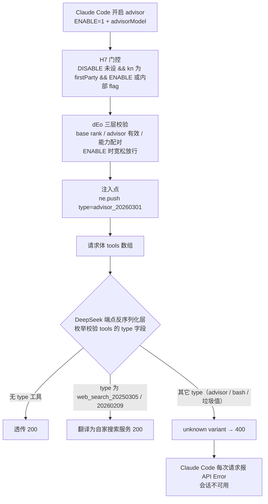

# DeepSeek Anthropic 兼容端点拒绝 Claude Code advisor 工具（400 unknown variant）

## 一句话定位

Claude Code 开启实验性 advisor 功能后，每次请求会注入一个 `{type:"advisor_20260301", name:"advisor", model:<advisorModel>}` 服务端工具；DeepSeek 的 Anthropic 兼容端点（`api.deepseek.com/anthropic`）在**请求反序列化阶段**对 `tools[].type` 做严格枚举白名单校验（仅放行 `web_search_20250305` / `web_search_20260209` 两个变体），`advisor_20260301` 不在其中 → **整个请求 400，启用后对话完全不可用**。

它**不是** @cometix 恢复版的 bug，**也不是** DeepSeek 模型端的问题——错误由 DeepSeek 端点服务端反序列化层在模型调用前产出；它**也不是**官方文档写明的兼容性差异——DeepSeek 官方 tools 文档没提 `type` 字段，白名单是本案例实测发现的隐性约束。

## 对象

| 维度 | 事实 |
|---|---|
| 兼容端点 | `https://api.deepseek.com/anthropic`（DeepSeek 官方 Anthropic 兼容 API） |
| 客户端 | `@cometix/claude-code` 2.1.219（CometixSpace 恢复版，镜像官方 v2.1.219 行为） |
| 触发开关 | `CLAUDE_CODE_ENABLE_EXPERIMENTAL_ADVISOR_TOOL=1` + settings `advisorModel` |
| 故障工具 | `{type:"advisor_20260301", name:"advisor", model}`（官方 beta `advisor-tool-2026-03-01`） |
| 故障形态 | 每次请求 `400 invalid_request_error`，所有携带工具列表的请求全部失败 |

## 当前观察基线

- 复现时间：2026-08-02（9 组 curl 对照实验 + 真实会话 `claude -p` 复现均在同日完成）
- 客户端：`@cometix/claude-code` 2.1.219（win32-x64 平台包，Node 22）
- 端点行为：白名单 `{web_search_20250305, web_search_20260209}`（错误消息明示，7 种 type 输入下列表恒定）
- 换基线风险：DeepSeek 端点白名单可能随适配扩展（web_search 已从 20250305 进化出 20260209）；Claude Code 工具类型版本化名可能变化 → 上游任一方行为变化后本页可能转 `stale`

## 现象与影响

开启 advisor 后（2026-08-02 实测），**每条消息**都报：

```text
API Error: 400 Failed to deserialize the JSON body into the target type:
tools[13]: unknown variant `advisor_20260301`, expected `web_search_20250305` or
`web_search_20260209` at line 1 column 85004
```

- 影响：所有携带工具列表的请求（主对话、`/advisor`、子代理）全部失败；`claude -p` 一条简单 prompt 也在 560ms 内被拒（0 输入/输出 token，`duration_api_ms: 0`）
- 不是偶发：只要开启开关，**100% 必现**

## 故障链路（一张图）



> 关于「为什么请求能到 DeepSeek 网关」：`kn()` 是**网关模式**分类（Bedrock/Vertex/Foundry/网关认证等开关都没配时默认 `"firstParty"`），`ANTHROPIC_BASE_URL` **不参与** `kn()` 判定——它只决定请求发往哪个地址。所以本案例是：模式仍按 firstParty（H7 门 2 通过）→ advisor 照常注入 → 请求发往 base URL（DeepSeek 端点）→ 在端点反序列化层被拒。真实会话复现（对照 9）就是这条链路的直接证明。

> 关于「没配 advisorModel 怎么也会注入」：`advisorModel` 的配置入口除了 settings 字段，还有 `/advisor <model>` 命令（写入同一个字段）与 `--advisor` flag；没有 `ADVISOR_MODEL` 环境变量。案例实测中 `/advisor` 设置过 advisor model，故 `dEo` 的 advisorModel 存在性检查通过。

## 定位过程（排除法 → 对照实验 → 字节定位）

### 排除项（先排除，再定位）

1. **不是 @cometix 恢复版的 bug**：注入逻辑（`dEo` 校验 / `ne.push` 注入 / 环境变量注册）在 2.1.219 cli.js 里完整且与官方文档描述一致；恢复版忠实镜像官方（详见 [[cometix-claude-code-restore]]）。此项为**推断级**——官方自 v2.1.113 起无纯 JS 分发，无法逐字节对照官方原生二进制。
2. **不是 DeepSeek 模型端**：400 在反序列化阶段产生（错误类型 `invalid_request_error`、0 token 消耗、`duration_api_ms: 0`），模型根本没收到请求。

### 对照实验（9 组，全部实测）

| # | 请求 tools 内容 | 结果 |
|---|---|---|
| 1 | 无 tools | 200 |
| 2 | `{type:"web_search_20250305", name:"web_search"}` | 200 |
| 3 | `{type:"web_search_20260209", name:"web_search"}` | 200（白名单第二项实测可用） |
| 4 | `{type:"advisor_20260301", name:"advisor", model:"opus"}` | **400** unknown variant |
| 5 | `{type:"bash_20250513", name:"Bash", description, input_schema}` | **400** 同型错误 |
| 6 | `{type:"computer_20250124", name:"Computer", ...}` | **400** 同型错误（真实工具类型） |
| 7 | `{type:"xyz_999", name:"X", ...}`（垃圾值） | **400** 同型错误 |
| 8 | `{name:"Bash", description, input_schema}`（无 type 的标准格式） | 200 |
| 9 | 真实会话：ENABLE=1 + `claude -p "just say hi"` | **400**（`tools[13]`，与主对话逐字同错） |

关键观察：**7 种不同 type 输入下，expected 列表恒为「`web_search_20250305` or `web_search_20260209`」两项**，且两项均实测 200。按 serde 枚举错误「穷举全部变体」的语义，这个列表就是 `tools[].type` 字段的完整白名单（推断，接近形式证明；serde 别名为理论边界）。

### 客户端源码定位（win32-x64 平台包 cli.js，21.7MB 压缩 bundle，约 5 万行）

以下对照表用于在 cli.js 源码中定位各符号（minify 名均已在本机 2.1.219 win32-x64 平台包核实）。**不需要核对源码的读者可以完全跳过。**

| 符号 | 内容 |
|---|---|
| `CLAUDE_CODE_ENABLE_EXPERIMENTAL_ADVISOR_TOOL` | 环境变量开关注册 |
| `H7` | advisor 总开关：DISABLE 检查 → kn() 非 firstParty → ENABLE → 内部 flag 兜底 |
| `kn` | 网关模式分类：默认 `"firstParty"`；`ANTHROPIC_BASE_URL` 不参与判定 |
| `dEo` | advisor 模型校验：H7 门控 + 三层检查（base rank / advisor 有效 / 能力配对）+ 警告文案 |
| `pEo` / `Dws` | advisorModel 读取：从设置对象取字符串（settings 字段 / `/advisor` 命令写入同一处） |
| `KDo` | 普通工具 schema 构造：仅 `{name, description, input_schema}`，全路径无 type 字段 |
| `P6s` | 无 advisor 时清理历史 `advisor_tool_result` / `server_tool_use(advisor)` 块 |
| `ZZg` | 配对错误串 `"cannot be used as an advisor when the request model is"` |
| `YQu` | advisor 使用说明提示词块（有 advisor 时注入系统提示词） |

**在源码中检索**（inline 结构与文案类建议直接搜字符串）：

- `type:"advisor_20260301"` → 注入点（inline：`if(_)ne.push({type:"advisor_20260301",name:"advisor",model:_})`）
- `type:"web_search_20250305"` → web_search 工具构造（inline，带 type 的白名单工具）
- `Advisor set to` → `/advisor` 命令处理（写入 userSettings + 提示文案）
- `Advisor disabled` → `dEo` 的 base 模型无 rank 警告（bundle 中破折号为 `—` 字面转义，勿带破折号搜）
- `Server-Side Tools: Advisor (Beta)` → 官方 API 文档文本（内嵌系统提示词：工具定义、配对表、判别联合）
- `advisor_tool_result` → 流式回调与多轮清理

## 本项目可借鉴点

1. **「平时没事、开一个开关就全挂」的标准排查路径**：先排除客户端与模型端（字节定位 + 错误阶段分析：0 token / 反序列化阶段错误 → 模型端排除；注入代码完整 → 客户端排除），再用「最小差分对照」锁定服务端约束（无 type / 白名单 type / 其它 type 三组对比一次就能定位）。
2. **错误文本是金矿**：`unknown variant` + expected 列表直接把服务端的枚举白名单暴露在错误消息里——不需要逆向端点，错误消息即文档。
3. **兼容端点的隐性约束要实测**：DeepSeek 官方 tools 文档只列 name/input_schema/description，没提 type 字段——但实测发现带 type 的工具除了两个 web_search 变体全被拒。文档没有 ≠ 约束不存在。
4. **真实会话复现是「推断 → 硬事实」的关键一步**：curl 只能证明端点行为，`claude -p` 复现才能坐实客户端行为（每次请求注入、全挂必现）。

## 本项目不应照搬点

- **不要把「错误格式像 serde」直接当成「网关是 Rust 实现」的定论**：格式三段式逐字对应 Rust 生态（axum `JsonDataError` → `serde_path_to_error` → serde 枚举模板 → serde_json）是高置信度推断，但 DeepSeek 从未公开网关技术栈；表述时应区分「错误文本特征」与「内部实现」。

## 常见误解 / 易错点

- ❌「cometix 恢复版没做好 advisor」→ 实为恢复版忠实镜像官方（注入代码完整），被拒发生在第三方端点。
- ❌「DeepSeek 模型不认识 advisor 工具」→ 模型根本没参与；400 是端点反序列化层（模型调用前）的拒绝。
- ❌「白名单只有 web_search 两个变体是瞎猜」→ 由 7 种 type 输入下 expected 列表恒为两项 + 两项均实测 200 支撑（强证据；serde 别名为理论边界）。
- ❌「DeepSeek 永远不可能支持 advisor」→ 过度断言。第三方网关已存在自行实现 advisor 的公开先例（LiteLLM 在自家网关实现 advisor：本地编排 + 剥离工具，PR #25525）；正确表述是「截至 2026-08-02 未适配，枚举直接拒绝」。
- ❌「错误格式像 serde 所以网关是 Rust 实现」→ 高置信度推断而非定论；表述应区分「错误文本特征」与「内部实现」。

## 证据与复核

**一手来源**（本页事实主体）：
- 9 组请求实测：`POST https://api.deepseek.com/anthropic/v1/messages`，`anthropic-version: 2023-06-01`，Bearer 认证（复现命令见下，与上方对照表**一一对应**）
- 真实会话复现：`CLAUDE_CODE_ENABLE_EXPERIMENTAL_ADVISOR_TOOL=1` 时 `claude -p "just say hi" --output-format json` → `tools[13]: unknown variant advisor_20260301`（2026-08-02，逐字同错）
- cli.js 符号定位（win32-x64 平台包，minify 符号与检索字符串均逐一经本机 cli.js 核实在场，见「定位过程」源码定位节）

**外部佐证**（2026-08-02 网络核查）：
- 错误格式三段式与 Rust 生态逐字对应：`Failed to deserialize the JSON body into the target type` = **axum** `JsonDataError` rejection 响应正文（docs.rs/axum/0.7.4 与 0.8.4 rejection.rs）；`tools[0]:` 路径前缀 = **serde_path_to_error** Display 格式（axum Json extractor 自 PR #1371 内置）；`unknown variant ... expected ... or ...` = **serde** 枚举错误默认模板（serde-rs/json issue #1013 同格式实录）；`at line N column M` = **serde_json** Display 追加
- DeepSeek 端点拒绝 Claude Code 新特性的历史实录：`messages[1].role: unknown variant 'system'`（deepseek-ai/DeepSeek-V3 issue #1369）、`image` 内容块（issue #1026）、awesome-deepseek-agent issue #167
- DeepSeek 官方 Anthropic 兼容端点文档（api-docs.deepseek.com/guides/anthropic_api/）：tools 支持表只列 name/input_schema/description，未提及 type 字段；deepseek-ai 组织（35 仓库）无网关实现仓库、从未发布 OpenAPI
- 第三方网关拒绝/未适配 advisor 的公开先例：LiteLLM PR #25525（支持前未知工具类型抛 ValueError）、opencode issue #21789（Go switch 缺 advisor 分支）、claude-agent-sdk-python issue #875
- 官方 advisor 文档：platform.claude.com/docs/en/agents-and-tools/tool-use/advisor-tool（2026-04-09 发布、Beta）；code.claude.com/docs/en/advisor（要求 Claude Code ≥2.1.98，Fable 5 需 ≥2.1.170）

**证据边界（未逐一复核）**：
- 「DeepSeek 网关是 Rust/axum/serde 生态」为**高置信度推断（>90%）**：错误文本三段式逐字对应 + DeepSeek 端点历史实录 + 网关开发无需自定义即可得到该格式（axum 默认组合），但 DeepSeek 官方从未公开技术栈。*此段外部背景系二手（社区推断 + 错误格式分析），见证据边界。*
- 「expected 列表 = 完整白名单」依赖 serde 枚举错误穷举语义；若端点改用非 serde 校验器，语义推断需重验（实测 7 输入恒两项已是最强直接证据）
- 未测 name 级/参数级二次校验（白名单 type + 自定义 name 的行为）
- 「不是 cometix 引入」为推断（官方自 v2.1.113 起无纯 JS 分发，无法逐字节对照）
- DeepSeek 白名单与工具版本化名均可能随适配演进；上游行为变化后需复核

**复现命令**（PowerShell 7+，每组一行，与对照表编号一一对应；`<KEY>` 换成自己的 DeepSeek key；400 响应用 `-SkipHttpErrorCheck` 查看 body）：

```powershell
# 组 1：无 tools → 期望 200
$H=@{Authorization='Bearer <KEY>';'anthropic-version'='2023-06-01'};$B='{"model":"deepseek-v4-flash","max_tokens":16,"messages":[{"role":"user","content":"hi"}]}';iwr 'https://api.deepseek.com/anthropic/v1/messages' -Method Post -Headers $H -Body $B -SkipHttpErrorCheck
# 组 2：type=web_search_20250305 → 期望 200
$H=@{Authorization='Bearer <KEY>';'anthropic-version'='2023-06-01'};$B='{"model":"deepseek-v4-flash","max_tokens":16,"messages":[{"role":"user","content":"hi"}],"tools":[{"type":"web_search_20250305","name":"web_search","max_uses":1}]}';iwr 'https://api.deepseek.com/anthropic/v1/messages' -Method Post -Headers $H -Body $B -SkipHttpErrorCheck
# 组 3：type=web_search_20260209 → 期望 200
$H=@{Authorization='Bearer <KEY>';'anthropic-version'='2023-06-01'};$B='{"model":"deepseek-v4-flash","max_tokens":16,"messages":[{"role":"user","content":"hi"}],"tools":[{"type":"web_search_20260209","name":"web_search","max_uses":1}]}';iwr 'https://api.deepseek.com/anthropic/v1/messages' -Method Post -Headers $H -Body $B -SkipHttpErrorCheck
# 组 4：type=advisor_20260301 → 期望 400
$H=@{Authorization='Bearer <KEY>';'anthropic-version'='2023-06-01'};$B='{"model":"deepseek-v4-flash","max_tokens":16,"messages":[{"role":"user","content":"hi"}],"tools":[{"type":"advisor_20260301","name":"advisor","model":"opus"}]}';iwr 'https://api.deepseek.com/anthropic/v1/messages' -Method Post -Headers $H -Body $B -SkipHttpErrorCheck
# 组 5：type=bash_20250513（带 schema）→ 期望 400
$H=@{Authorization='Bearer <KEY>';'anthropic-version'='2023-06-01'};$B='{"model":"deepseek-v4-flash","max_tokens":16,"messages":[{"role":"user","content":"hi"}],"tools":[{"type":"bash_20250513","name":"Bash","description":"run cmd","input_schema":{"type":"object","properties":{}}}]}';iwr 'https://api.deepseek.com/anthropic/v1/messages' -Method Post -Headers $H -Body $B -SkipHttpErrorCheck
# 组 6：type=computer_20250124 → 期望 400
$H=@{Authorization='Bearer <KEY>';'anthropic-version'='2023-06-01'};$B='{"model":"deepseek-v4-flash","max_tokens":16,"messages":[{"role":"user","content":"hi"}],"tools":[{"type":"computer_20250124","name":"Computer","description":"x","input_schema":{"type":"object","properties":{}}}]}';iwr 'https://api.deepseek.com/anthropic/v1/messages' -Method Post -Headers $H -Body $B -SkipHttpErrorCheck
# 组 7：垃圾 type=xyz_999 → 期望 400
$H=@{Authorization='Bearer <KEY>';'anthropic-version'='2023-06-01'};$B='{"model":"deepseek-v4-flash","max_tokens":16,"messages":[{"role":"user","content":"hi"}],"tools":[{"type":"xyz_999","name":"X","description":"x","input_schema":{"type":"object"}}]}';iwr 'https://api.deepseek.com/anthropic/v1/messages' -Method Post -Headers $H -Body $B -SkipHttpErrorCheck
# 组 8：无 type 标准工具 → 期望 200
$H=@{Authorization='Bearer <KEY>';'anthropic-version'='2023-06-01'};$B='{"model":"deepseek-v4-flash","max_tokens":16,"messages":[{"role":"user","content":"hi"}],"tools":[{"name":"Bash","description":"run cmd","input_schema":{"type":"object","properties":{}}}]}';iwr 'https://api.deepseek.com/anthropic/v1/messages' -Method Post -Headers $H -Body $B -SkipHttpErrorCheck
# 组 9：真实会话复现 → 期望 400（跑完记得 Remove-Item Env:CLAUDE_CODE_ENABLE_EXPERIMENTAL_ADVISOR_TOOL 复原）
$env:CLAUDE_CODE_ENABLE_EXPERIMENTAL_ADVISOR_TOOL='1';claude -p 'just say hi' --output-format json
```

## 未确认点

- DeepSeek 网关内部实现（官方未确认；错误文本特征指向 Rust/axum/serde，>90% 置信度）
- 白名单是否会随 Claude Code 工具演进扩展（web_search 从 20250305 进化出 20260209，说明 DeepSeek 在跟进 web_search；advisor 是否跟进未证实）
- name 级/参数级是否还有二次校验（未测）
- 是否存在中间转发层影响（本次实测直连端点，无代理；claude-code-router 类工具未涉）
- **改 type / 字段欺骗反序列化后，advisor 是否部分生效**（比如被端点当普通工具透传、模型能否真收到 advisor 语义）——**未尝试**，不下定论

## 后续动作

- 机制结论已凝成，advisor 在 Claude Code 侧的完整运作链路见 [[claude-code-advisor-tool]]（mechanism 页）；本页聚焦调查过程与端点行为快照。
- 可尝试方向（未执行，供维护者决定）：① 「改 type 欺骗」实测（对应未确认点最后一条）；② 用 LiteLLM 之类已实现 advisor 的第三方网关做对照（PR #25525）；③ 跟进 DeepSeek 端点是否新增 advisor 白名单变体。

## 相关页面

- [[claude-code-advisor-tool]] —— advisor 功能在 Claude Code 侧的运作全链路（机制页）
- [[cometix-claude-code-restore]] —— 本次故障所在客户端（恢复版）的流水线与补丁机制背景
