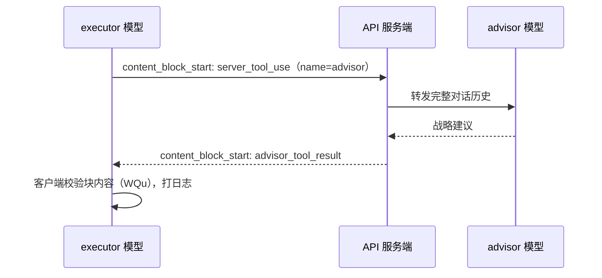

# Claude Code advisor 工具运作全链路

你敲下 `/advisor opus`，回车。屏幕提示 `Advisor set to opus`。从这一刻起，你发的每一条消息背后都会多一段过程：生成中的模型在关键时刻可能会调用一个名为 advisor 的工具，把完整对话历史转发给一个更强的模型，拿回一段战略建议，再继续生成。

本文梳理这个功能在 Claude Code 内部的完整链路：开关、配置、注入、调用、多轮、错误处理。

机制基于 `@cometix/claude-code` 2.1.219（镜像官方行为）的 `cli.js` 静态阅读与官方嵌入文档；「服务端执行」环节为文档级证据，未跑过真实成功会话（见文末证据节）。案例侧（DeepSeek 端点把它拒绝）见 [[deepseek-compat-advisor-400]]，本文不重复。

## 开关：H7 的四层门控

advisor 是实验性服务端工具（beta `advisor-tool-2026-03-01`），开启要过 `H7()` 的四层门：

```js
function H7(){
  if(Z.CLAUDE_CODE_DISABLE_ADVISOR_TOOL)return!1;                  // 门 1：显式禁用
  if(kn()!=="firstParty"||!ZN())return!1;                          // 门 2：网关模式 + beta 可用
  if(Z.CLAUDE_CODE_ENABLE_EXPERIMENTAL_ADVISOR_TOOL)return!0;      // 门 3：显式开启
  return Ke("tengu_sage_compass2",{}).enabled??!1                  // 门 4：内部实验 flag 兜底
}
```

门 1 是总闸（`CLAUDE_CODE_DISABLE_ADVISOR_TOOL`）；门 3 是用户侧开关；门 4 是官方内部灰度旗标；门 2 是平台门槛——网关模式必须 firstParty 且实验 beta 未被禁用。

门 2 里的 `kn()` 是网关模式分类：Bedrock / Vertex / Foundry / Mantle 等云开关或 gatewayAuth 认证没配时，默认返回 `"firstParty"`。**`ANTHROPIC_BASE_URL` 不参与 `kn()` 判定**——它只决定请求发往的地址，模式照旧按 firstParty 走。这是 [[deepseek-compat-advisor-400]] 里「接了 DeepSeek 端点、advisor 却照常注入」的原因。

`ZN()` 也是合成判定：`o7n()`（网关模式是 firstParty / 云网关）且未禁用实验 beta（`x_e()`：`CLAUDE_CODE_DISABLE_EXPERIMENTAL_BETAS` 或组织级 hipaa 策略）。

## 配置：advisorModel 的三个入口

advisor 模型是谁，有三个配置入口：

- settings 的 `advisorModel` 字段（schema 描述：*"Advisor model for the server-side advisor tool."*）
- `--advisor <model>` 命令行 flag
- `/advisor <model>` 斜杠命令——写入的是同一个字段（userSettings），所以即使没碰过 settings，运行过 `/advisor` 就生效了（[[deepseek-compat-advisor-400]] 里「没配 advisorModel 却照样注入」的原因）

不存在 `ADVISOR_MODEL` 环境变量。

`/advisor` 命令定义：

```js
fVs={
  type:"local-jsx",                                 // 本地 JSX 命令（TUI 渲染）
  name:"advisor",
  description:"Let Claude consult a stronger model at key moments",
  requires:{ink:!0},
  thinClientDispatch:"control-request",
  get argumentHint(){return`[${[...kOt(),"off"].join("|")}]`},   // 动态补全
  isEnabled:()=>H7(), get isHidden(){return!H7()}
}
```

参数补全来自 `kOt()`（官方允许的 advisor 模型别名 `VQu = ["fable","opus","sonnet"]`）加 `off`（禁用）；命令的启用与隐藏绑定 `H7()`——四层门不开，命令不显示。

命令处理（节选）：

```js
r((c)=>c.advisorModel===i?c:{...c,advisorModel:i})   // 写入设置
let l=`Advisor set to ${s}${o}`                       // 提示文案
if(!gUe(t))l+=`\nNote: the current main model (...) does not support the advisor...`
else if(!Rdt(t,i))l+=`\nNote: ... is less capable than the current main model...`
```

设置时会当场体检：主模型不在 advisor 支持名单（`gUe`）→ 提示「当前主模型不支持 advisor」；advisor 模型能力不足（`Rdt`）→ 提示「advisor 不如主模型强，不会生效」。

每次请求前的真正校验在 `dEo`（三层：① base 模型有无 advisor rank；② advisor 模型是否有效；③ 能力配对）。**ENABLE 开关会宽松放行**：设了 `CLAUDE_CODE_ENABLE_EXPERIMENTAL_ADVISOR_TOOL=1` 时①②直接通过，③对模型目录查不到 rank 的模型（如自定义映射 `deepseek-v4-flash`）也放行——实验期的思路是「先跑通，配对的事以后再说」。

校验失败的分层日志（`[AdvisorTool]` 前缀，前两条附带一次性控制台警告）：

```text
[AdvisorTool] Skipping advisor - base model '...' does not support advisor
  console.warn: Warning: Advisor disabled — base model '...' has no advisor
  rank in the model catalog. Switch to a public model alias (opus, sonnet,
  fable) or set CLAUDE_CODE_ENABLE_EXPERIMENTAL_ADVISOR_TOOL=1.

[AdvisorTool] Skipping advisor - '...' is not a valid advisor model
[AdvisorTool] Skipping advisor - '...' cannot advise '...' (advisor must be
  at least as capable as the base model)
```

第一条警告的建议是「换公开模型别名（模型目录里有 `advisor_rank`，走完整校验）**或** 设 ENABLE 开关（跳过体检的旁路）」——官方把这条旁路写进了警告文案。

## 注入：tools 与系统提示词

agentic 请求（主线程 / agent / SDK / hook_agent 来源）会发生两处变化。

第一处：tools 数组多一个工具。普通工具由 `KDo` 构造（只有 `{name, description, input_schema}`，无 type 字段），advisor 是追加的：

```js
let ne=[...i.extraToolSchemas??[]];
if(_)ne.push({type:"advisor_20260301",name:"advisor",model:_});
```

`advisor_20260301` 这个带日期的 type 是协议签名，表示该工具由服务端执行。第三方兼容端点在反序列化阶段不认这个 type 就会直接拒绝（[[deepseek-compat-advisor-400]]）。`web_search` 也带 type（`web_search_20250305`），但它是兼容端点白名单里少有的版本化 type——「带 type 的工具」在 Anthropic 协议里是常态，问题在端点认不认这个日期。

第二处：系统提示词追加一段使用说明（源码 `YQu`）：

```text
# Advisor Tool

You have access to an `advisor` tool backed by a stronger reviewer model.
It takes NO parameters -- when you call advisor(), your entire conversation
history is automatically forwarded. They see the task, every tool call
you've made, every result you've seen.

Call advisor BEFORE substantive work -- before writing, before committing
to an interpretation, before building on an assumption. If the task
requires orientation first (finding files, fetching a source, seeing
what's there), do that, then call advisor. Orientation is not substantive
work. Writing, editing, and declaring an answer are.

Also call advisor:
- When you believe the task is complete. BEFORE this call, make your
  deliverable durable: write the file, save the result, commit the change.
  The advisor call takes time; if the session ends during it, a durable
  result persists and an unwritten one doesn't.
- When stuck -- errors recurring, approach not converging, results that
  don't fit.
- When considering a change of approach.

On tasks longer than a few steps, call advisor at least once before
committing to an approach and once before declaring done. On short
reactive tasks where the next action is dictated by tool output you just
read, you don't need to keep calling -- the advisor adds most of its
value on the first call, before the approach crystallizes.

Give the advice serious weight. If you follow a step and it fails
empirically, or you have primary-source evidence that contradicts a
specific claim (the file says X, the paper states Y), adapt. A passing
self-test is not evidence the advice is wrong -- it's evidence your test
doesn't check what the advice is checking.

If you've already retrieved data pointing one way and the advisor points
another: don't silently switch. Surface the conflict in one more advisor
call -- "I found X, you suggest Y, which constraint breaks the tie?"
The advisor saw your evidence but may have underweighted it; a reconcile
call is cheaper than committing to the wrong branch.
```

**中文译文**：

```text
# Advisor 工具

你有一个由更强的评审模型支撑的 `advisor` 工具。它**不接受任何参数**——
当你调用 advisor() 时，你的完整对话历史会被自动转发。对方能看到任务、
你做过的每一次工具调用、你看过的每一个结果。

在实质工作之前调用 advisor——在动手写之前、在认定某个解释之前、
在基于某个假设继续之前。如果任务需要先做方向性探索（找文件、查资料、
看看有什么），先做，再调用 advisor。方向性探索不算实质工作。写、改、
下结论才算。

另外在这些时候调用 advisor：
- 当你认为任务已经完成时。在这次调用**之前**，先把你的成果变得持久：
  写好文件、保存结果、提交改动。advisor 调用要花时间；如果会话在调用
  期间结束，落盘的结果还在，没落盘的结果就没了。
- 卡住的时候——错误反复出现、方案不收敛、结果对不上。
- 考虑改变方案的时候。

在超过几步的长任务上，至少在确定方案之前调用一次、在宣布完成之前
调用一次。在短的反应式任务上（下一步动作由刚读到的工具输出决定），
不需要反复调用——advisor 的价值在第一次调用时最大，趁方案还没成型。

认真对待建议。如果按建议走某一步却在实证上失败了，或者你有一手证据
反驳某个具体说法（文件上写的是 X、论文说的是 Y），那就调整。通过一次
自测**不是**建议错误的证据——它只说明你的测试没在检查建议在检查的东西。

如果你已经拿到指向某个方向的数据、而 advisor 指向另一个方向：不要默默
切换。再多调一次 advisor 把冲突摊开——"我发现了 X，你建议 Y，哪个约束
打破僵局？" advisor 看到了你的证据，但可能低估了它；一次对账调用，比
提交到错误分支便宜。
```

这段说明书定义了调用节奏：动手之前问（找文件、查资料这类方向性探索不算实质工作，写、改、下结论才算）；收工之前问（且先把成果落盘——调用要花时间，会话可能在调用期间结束，落盘的结果还在）；卡住时问、考虑换方法时问；短反应式任务不必反复调用（第一次调用的价值最大，趁方案还没成型）。最后两段定义了对建议的处置：按建议走且失败、或有一手证据反驳时才允许偏离——「通过自测不是建议错误的证据，它只说明测试没在检查建议在检查的东西」；数据与建议冲突时不要默默切换，再调一次摊牌——「我发现了 X，你建议 Y，哪个约束打破僵局？」——一次对账调用比提交到错误分支便宜。

## 调用：从 server_tool_use 到 advisor_tool_result

advisor 与普通工具的区别：

| 维度 | 普通工具（Bash / Read / Write） | advisor |
|---|---|---|
| 参数 | input_schema | 零参数（调用即转发全历史） |
| 执行方 | 客户端（本机执行） | 服务端 |
| 返回块 | `tool_use` / `tool_result` | `server_tool_use` / `advisor_tool_result` |
| 客户端可见性 | 完整结果 | 可能只有加密块（见下文） |
| type 字段 | 无 | `advisor_20260301` |

调用过程（流式）：



客户端侧的流式处理（`content_block_start` 分支）：

```js
case"server_tool_use":
  cr[pi.index]={...pi.content_block,input:""}
  if(pi.content_block.name==="advisor")tr=!0,
    w("[AdvisorTool] Advisor tool called"),
    O("tengu_advisor_tool_call",{model:i.model,advisor_model:_??"unknown"})
  break
case"advisor_tool_result":
  tr=!1,w("[AdvisorTool] Advisor tool result received")
  let Hn=WQu(pi.content_block)
  if(Hn!==void 0)w(`[AdvisorTool] Advisor tool result error: ${Hn}`),
    O("tengu_advisor_tool_error",{...,error_code:fe(Hn)})
  break
```

- `tr` 是「advisor 调用进行中」状态标志：`server_tool_use`（name=advisor）置位，`advisor_tool_result` 复位（具体消费方未探明）。
- `server_tool_use` 的 input 同样走 `input_json_delta` 流式拼装——零参数工具在协议层面也保留增量输入位。
- `WQu` 检查块内 `error_code`，官方枚举六个：`max_uses_exceeded`（调用次数超限）、`too_many_requests`、`overloaded`、`prompt_too_long`、`execution_time_exceeded`、`unavailable`。

响应块的 content 是判别联合：

| content 类型 | 字段 | 什么时候 |
|---|---|---|
| `advisor_result` | `text`, `stop_reason` | advisor 返回纯文本（如 Opus 4.8） |
| `advisor_redacted_result` | `encrypted_content`, `stop_reason` | advisor 返回加密输出（Opus / Fable / Mythos 家族） |

加密输出客户端读不了，只能原样回放（官方文档原话："you cannot read it, only replay it"）。信息边界是分层的：executor 只在 advisor 返回明文时看得到内容；用户能看到块的存在，但加密时同样读不了；能读加密内容的只有调用方服务端。消费方必须按 content 类型分支——无条件读 `.text` 对加密块只会读到空。

## 多轮：回填、关闭与清理

`advisor_tool_result` 块随 `response.content` 完整回填下一轮历史。如果后续轮次把 advisor 从 tools 移除、历史里还留着块，API 会 400——官方文档原话：

> If you remove the advisor tool from `tools` on a later turn while the history still contains `advisor_tool_result` blocks, the API returns a 400.

客户端错误预处理（`nus()`）专门匹配这类 400 的两句文案：`"Advisor tool result content could not be processed"` 和 `"found in advisor_tool_result blocks"`。

客户端还有一道自动防御（`P6s`）：会话没有 advisorModel 时，每次请求前把历史里的 `advisor_tool_result` / `server_tool_use(advisor)` 清理成占位文本 `[Advisor response]`——中途关闭 advisor 的会话不会因为残留块报错。

## 错误处理

配对错误（官方 API）：advisor 能力不配 executor 时返回 400，错误串 `ZZg = "cannot be used as an advisor when the request model is ..."`。客户端给出专门提示：*"The configured advisor model is not compatible with this request model — change or unset the advisorModel setting (or the --advisor flag) / run /advisor to change or disable the advisor"*。

协议不兼容（第三方端点）：未知工具类型在反序列化阶段被拒（`unknown variant advisor_20260301`），完整故事见 [[deepseek-compat-advisor-400]]。

## 设计推断

以下读作基于实现的合理推断，不是官方设计说明。

- **服务端工具而非客户端工具**：advisor 要读完整历史、要请更强的模型，历史在客户端、模型在服务端，执行放服务端是唯一自洽的切分；加密输出暗示 advisor 的思考过程不该裸露在 executor 的对话里。
- **零参数 + 自动转发全历史**：模型不需要自己拼上下文，省 token，也避免「手抄历史」这种又贵又可能抄错的做法。
- **说明书把调用时机写得很细**：advisor 调用要等另一个模型生成，成本结构不同，说明书本质是调用频率治理。
- **「通过自测不算反驳建议的证据」**：把「建议无效」的举证责任放到 executor 那边，防止用片面的自测把建议打回去。
- **type 带日期（`advisor_20260301`）**：工具协议的版本化签名惯例（web_search 同形态），beta 期新工具快速换代而不互相污染；副作用是兼容端点要把日期写进白名单才认。

## 对三种读者意味着什么

普通用户：开的不是「多一个工具」，而是「模型多了一个会先想再做的习惯」。代价是调用要等另一个模型生成（消息变慢），且 advisor 原话可能以加密块躺在 transcript 里。`/advisor off` 随时可退。

第三方网关开发者：支持 advisor 不是白名单加个 type 就完事——要实现 `server_tool_use` 的服务端转发、`advisor_tool_result` 生成与回填、配对校验（400 invalid_request_error）、多轮移除规则。LiteLLM 走的是本地编排路线（PR #25525）：剥掉 advisor 工具，自己跑一次子调用再把结果拼回去。

逆向研究者：这是观察 Anthropic 协议演进的样本——带日期的 type 签名、`server_tool_use` / `advisor_tool_result` 新块类型、`error_code` 六枚举、加密输出块。整个客户端管线（门控→校验→注入→回调→清理）都在 cli.js 里可见。

## 想自己翻源码？

符号表（minify 名，均已在本机 2.1.219 win32-x64 平台包核实）：

| 符号 | 内容 |
|---|---|
| `H7` | advisor 总开关（四层门控） |
| `kn` | 网关模式分类；`ANTHROPIC_BASE_URL` 不参与 |
| `dEo` | 请求前模型校验（三层检查 + 警告文案） |
| `pEo` / `Dws` | advisorModel 读取 |
| `KDo` | 普通工具 schema 构造（无 type 字段） |
| `P6s` | 无 advisor 时清理历史 `advisor_tool_result` |
| `WQu` | `advisor_tool_result` 错误检查（error_code 六枚举） |
| `ZZg` | 配对错误串 |
| `YQu` | 使用说明书提示词块（全文见上文） |
| `VQu` | advisor 模型别名：fable / opus / sonnet |
| `ixy` | advisor 错误码枚举（6 项） |

检索字符串：`type:"advisor_20260301"`（注入点）、`Advisor set to`（/advisor 命令处理）、`Advisor disabled`（dEo 警告；bundle 中破折号为 `—` 字面转义，勿带破折号搜）、`# Advisor Tool`（YQu 开头）、`advisor_tool_result`（回调与清理）、`Server-Side Tools: Advisor (Beta)`（官方文档文本）。

## 边界与未探明

- 仅 agentic query 注入（非 agentic 查询不计算 advisorModel、不注入）。
- `kn()` 非 firstParty（Bedrock / Vertex / Foundry / 网关认证）时 `H7` 直接 false——云网关场景不可用；自定义 base URL 不改变模式。
- 模型配对硬约束（官方配对表：executor haiku/sonnet/opus ↔ advisor opus/fable/mythos 等；无效配对 400）。
- 版本：官方文档要求 Claude Code ≥2.1.98（Fable 5 需 ≥2.1.170）；观察基线 2.1.219；minify 符号名随版本变化，跨版本核对以检索字符串为准。
- 未探明：`ZN()` 里 `cY("hipaa")` 的具体语义；`vi()` 模型别名解析的目录结构；`tr` 标志的消费方；`YQu` 跨版本的措辞漂移（本页引 2.1.219 全文）。

## 证据与复核

- **一手**：`@cometix/claude-code` win32-x64 平台包内 `cli.js`（21.7MB 压缩 bundle，约 5 万行、最长行约 538KB；字符串检索定位，勿整行打印）——`H7` / `dEo` / `pEo` / `Dws` / `KDo` / `P6s` / `WQu` / `ZZg` / `YQu` / `VQu` / `ixy` 全部经本机源码核实在场；YQu 全文、官方配对表、判别联合、错误码枚举逐字取自 bundle 内嵌文本。
- **文档**：platform.claude.com/docs/en/agents-and-tools/tool-use/advisor-tool（工具定义、配对表、判别联合、beta 头）；code.claude.com/docs/en/advisor（Claude Code 侧配置与版本要求）。
- **未做**：未跑真实 advisor 成功会话（DeepSeek 端点不支持、官方 API 不可达）——「服务端执行 / 多轮回填 / 加密输出」为文档级证据。真实失败的完整复现见 [[deepseek-compat-advisor-400]]（9 组 curl + 真实会话）。

## 相关页面

- [[deepseek-compat-advisor-400]] —— 第三方兼容端点（DeepSeek）未实现 advisor 时的故障案例与实测
- [[cometix-claude-code-restore]] —— 本观察所在客户端（恢复版）的流水线与补丁机制背景
