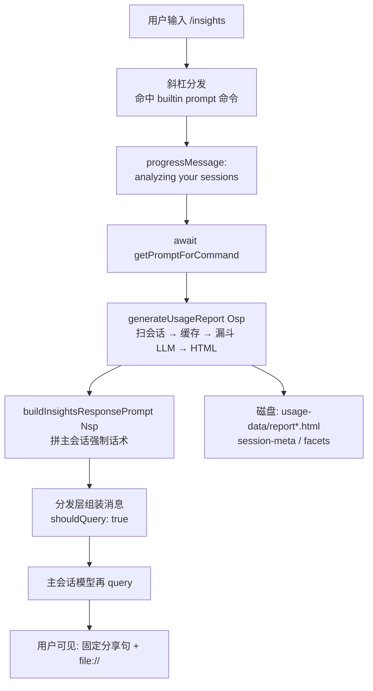
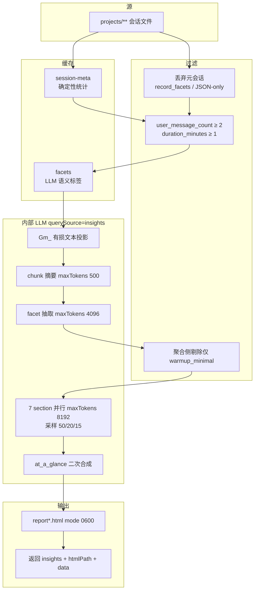

# Claude Code `/insights` 命令的端到端流程

## 一句话结论

`/insights` 是 builtin 的 **`type: "prompt"`** 斜杠命令：在拼给当前会话主模型的内容之前，先在**本机**扫历史会话、读写 **session-meta / facets** 缓存，并把会话文本的**有损投影**送进多轮 **内部** 模型调用（`querySource: "insights"`）做成 HTML 使用报告，再要求主模型 **原样** 输出一段带 `file://` 链接的固定分享话术。磁盘上的报告与缓存是本地的；语义分析依赖模型后端，不是「纯本地、数据不出机」的离线分析。聊天窗只负责递链接并允许继续追问，报告正文在 HTML。

## 输入

| 输入 | 说明 |
|---|---|
| 用户动作 | 在交互会话中输入 `/insights` |
| 命令侧约束（包装层） | `requires.workspace: true`；`disableModelInvocation: true`（包装层禁止被 Skill/Agent 等路径自动调用；实现体对象本身无此字段） |
| 本地数据 | 配置根下的 `projects/`（会话 transcript）；可选已有 `usage-data/` 缓存 |
| 模型侧 | 内部 `querySource: "insights"` 调用会带上经 `Gm_` 投影（及可能的 chunk 摘要）后的会话文本；走与普通对话相同的模型路由默认（Opus 侧 `sS()`） |
| 本页证据 | `artifacts/2.1.209/global-prefix/node_modules/@cometix/claude-code/cli.js`（包内 `VERSION` 字面量为 `2.1.209`） |

**未做**：实际执行 `/insights`、请求线上 API、读取本机用户隐私报告内容。结论来自对该 `cli.js` 的 **acorn 定位 + 函数体/字面量锚点核对**（不是对整包 20MB 做一次完整语义还原）。

各阶段 **官方提示词全文与中文对照** 见：[Claude Code /insights 内嵌提示词契约](../concepts/claude-code-insights-prompts.md)。本页只维护链路与设计取舍，提示词不双源粘贴。

---

## 过程

### 总览图



```text
时间线（用户感知）

  输入 /insights
       │
       │  ← 卡住一段时间（本地扫盘 + 可能多次内部 LLM）
       │     UI 进度文案: analyzing your sessions
       ▼
  聊天窗出现固定两行英文分享 + file://…
       │
       ▼
  浏览器打开 HTML 看完整报告
       │
       ▼
  （可选）在同一会话继续问「展开 friction / suggestions」
```

下文按 **L0 → L6** 展开；每段末「设计取舍」只写能被源码结构支撑的推断，不写未出现的产品口号。

**调用嵌套（读 L1–L3 时用）**：L0 查出命令对象后，分发层进入 **`Zxs`**（prompt 路径）。`Zxs` **await** `getPromptForCommand`（L3）；L3 内 **await** `Osp`（L4）再 `Nsp`（L5 模板）。`Zxs` 把返回 text 放进 **isMeta** 消息并 **`shouldQuery: true`**，主会话再 query。L1/L2/L3 是外壳套内核，不是三段串联。

---

### L0 · 斜杠识别与命令查找

用户输入以 `/` 开头时进入 slash 处理链。模块导出中可见 `processSlashCommand` / `processPromptSlashCommand` / `looksLikeCommand` 等符号（export 表约在 bundle 中部）。随后在已加载命令表中按 **name** 解析；`insights` 以 **`source: "builtin"`** 注册，不是 skill 文件、不是 plugin。

**入**：原始输入字符串。  
**出**：命令描述符（含 `type`、`getPromptForCommand`、`progressMessage` 等）。

---

### L1 · 命中命令对象：实现体 + 懒加载包装

acorn 解析到 **两个** `name: "insights"` 对象字面量：

| 字段 | 实现体（模块 default） | 懒加载包装（命令表入口） |
|---|---|---|
| `type` | `"prompt"` | `"prompt"` |
| `source` | `"builtin"` | `"builtin"` |
| `description` | `Generate a report analyzing your Claude Code sessions` | 同左 |
| `progressMessage` | `analyzing your sessions` | 同左 |
| `contentLength` | `0` | `0` |
| `disableModelInvocation` | （无此字段） | **`true`** |
| `requires` | （无） | **`{ workspace: true }`** |
| `getPromptForCommand` | async，**1** 参数，内联完整实现 | async，**2** 参数，动态加载后转发 |

包装层 `getPromptForCommand` 结构（brace 抽出）：

```text
async getPromptForCommand(e, t) {
  r = (await dynamicImport → 模块 Fsp).default
  if (r.type !== "prompt") throw Error("unreachable")
  return r.getPromptForCommand(e, t)
}
```

同一模块导出表（acorn 解析含 `generateUsageReport:` 的对象）语义名 → 实现名：

| 导出语义名 | 实现名 | 职责一句话 |
|---|---|---|
| `generateUsageReport` | `Osp` | 报告引擎入口 |
| `buildInsightsResponsePrompt` | `Nsp` | 主会话强制话术模板 |
| `aggregateData` | `Msp` | 跨会话聚合 |
| `extractToolStats` | `Dsp` | 单会话工具/语言等统计 |
| `detectMultiClauding` | `Lsp` | 多会话时间重叠 |
| `deduplicateSessionBranches` | `Vm_` | 同 session id 分支去重（保留「更优」meta） |
| `buildExportData` | `lh_` | 结构化导出形状 |
| `normalizeSessionMeta` | `Psp` | session-meta 规范化相关 |
| `default` | `ph_` | 命令实现对象 |

命令对象是 CLI **内存注册表条目**（分发按 name 查找），不是 API 请求字段，也不是 settings 总开关。用户路径读**包装层**（含 `disableModelInvocation`）。

**设计取舍**

- **为何 `prompt` 而不是 `local`？**  
  `local` 在本地 `call` 后直接返回文本/跳过主模型；`prompt` 在 `getPromptForCommand` 之后把内容打成会话消息，并在分发路径上设 **`shouldQuery: true`**（`await e.getPromptForCommand` 调用点附近可核对）。产品形态是「报告 + 同一会话可追问」，不是一次性 dump。
- **为何包装层 `disableModelInvocation: true`？**  
  引擎会读大量历史并多次内部调模型；该标志挂在**命令表包装对象**上，限制 Skill/Agent 等自动调用路径，要求用户显式输入。实现体本身不带此字段——约束生效取决于分发层读的是包装描述符。

---

### l2

**L2 · prompt 分发：先 await 分析，再 shouldQuery**

主路径实现函数为 **`Zxs`**（用户 `case "prompt"` 直接 await；`processPromptSlashCommand`/`cxy` 为旁路薄封装）。成功返回时 **`shouldQuery` 恒为 true**：该字段是分发返回值上的布尔，表示「是否再调**主会话**模型」，与 `Osp` 内部的 `querySource:"insights"` 调用无关（内部调用发生在 await `getPromptForCommand` **之内**）。

`Zxs` 在 `await e.getPromptForCommand(...)` 返回后大致会：

1. 取出 text 块，记 telemetry / hooks / allowedTools 等  
2. 组装 `messages`：用户可见命令消息 + **`isMeta: true` 消息（内容 = L3 返回的 text 块）**  
3. **`shouldQuery: true`** → 上层主会话再 query  

对 `/insights`：步骤 1 内部可能很久（整份 `Osp`）；进度靠 `progressMessage`。

[**P-user-reply**](../concepts/claude-code-insights-prompts.md#p-user-reply) 挂进**主会话**上下文的位置就在本层步骤 2–3（不在 `Osp` 的三次 `hct` 里）：

```text
L3 返回 [{ type:"text", text: Nsp(...) }]   // 仅拼好字符串
    │
    ▼
Zxs: Ur({ content: blocks, isMeta: true })  // ★ 挂进当前会话 messages
    │
    ▼
shouldQuery: true → 主会话模型读 isMeta → 输出分享句
```

主模型本轮读到的是**已经生成好的** `Nsp` 全文（insights JSON + `file://` + verbatim 指令），不是「请你去分析」的空指令。原文见契约页 [P-user-reply](../concepts/claude-code-insights-prompts.md#p-user-reply)。

```text
Zxs
  await getPromptForCommand   ← 重活（L3→Osp）
  messages += isMeta(Nsp)     ← P-user-reply 进主会话
  shouldQuery: true
```

---

### L3 · `getPromptForCommand` 实现体

```text
async getPromptForCommand(/* e */) {
  collectRemote = false                    // let t = !1，写死
  { insights, htmlPath, data, remoteStats }
      = await Osp({ collectRemote })       // L4：内部模型全在这里

  reportUrl = `file://${htmlPath}`         // 字面拼接；见「已知边界」

  statsLine = sessions · messages · hours · commits
              （若 total_sessions_scanned > total_sessions
                则显示 “N sessions total · M analyzed”）

  summaryText = 有 at_a_glance
      ? markdown（What's working / hindering / quick wins / ambitious…）
      : "_No insights generated_"

  header = "# Claude Code Insights\n" + statsLine + 日期范围

  return [{
    type: "text",
    text: Nsp({                            // 只生成字符串；模板正文 ↓
      insightsJson: JSON.stringify(insights, null, 2),
      reportUrl,
      htmlPath,
      facetsDir: rIo(),   // usage-data/facets
      header,
      summaryText,
    }),
  }]
}
```

模板正文：[P-user-reply](../concepts/claude-code-insights-prompts.md#p-user-reply)。

L3 **不调**主会话模型、也**不**调 `querySource:"insights"`。  
- 内部分析提示词：在 **L4.2（5）（6）** 的 `hct.userPrompt` 里挂上。  
- [P-user-reply](../concepts/claude-code-insights-prompts.md#p-user-reply)：此处由 `Nsp` **拼出**，真正进对话上下文要等 **L2 `Zxs` 的 isMeta + shouldQuery**。

**设计取舍**

- 分析必须在 `getPromptForCommand` 内完成：主模型本轮需要已存在的 `file://` 与 insights JSON。  
- **`collectRemote` / `remoteStats`**：调用处写死 `false` 传入，**`Osp` 不读参数对象**；`remoteStats` 对应未赋值局部。2.1.209 此路径上是遗留空槽，不能推断存在可打开的远程收集开关。

---

### L4 · 报告引擎 `generateUsageReport`（`Osp`）

#### L4.0 路径语义

| 函数 | 源码结构 | 含义 |
|---|---|---|
| `pn()` | 配置根（被 join） | Claude 配置目录（常见形如 `~/.claude`，绝对路径随环境变） |
| `xz()` | `join(pn(), "projects")` | 历史会话目录树 |
| `znn()` | `join(pn(), "usage-data")` | 使用数据根 |
| `rIo()` | `join(znn(), "facets")` | facet 缓存 |
| `P8s()` | `join(znn(), "session-meta")` | session-meta 缓存 |

```text
pn()  （配置根）
├── projects/                 ← xz()，transcript 源
│   └── <project-key>/
│         └── <session files…>
└── usage-data/               ← znn()
    ├── session-meta/         ← P8s()，确定性统计缓存
    ├── facets/               ← rIo()，LLM 语义标签缓存
    ├── report-YYYYMMDD….html
    └── report.html
```

#### L4.1 数据漏斗总图



#### L4.2 控制流分步（与 `Osp` await 序列对齐）

acorn 对 `async function Osp` 的 await 序列：

`ch_` → `Jm_` / `Promise.all` → `nIo` / `Promise.all` → `Ym_` / `Zm_` / `Promise.all` → `th_` → `$9.mkdir` → `$9.writeFile` ×2

结合函数体字面量，逐步如下。

##### （1）枚举会话 · `ch_()`

```text
ch_:
  readdir( projects 配置根 )
  每个子目录 → pMt 收集 { sessionId, path, mtime, size }
  每处理 10 个项目 → setImmediate 让出事件循环
  全部按 mtime 新 → 旧 排序后返回
```

`projects` 为空或 readdir 失败 → 返回 `[]`，后续空跑。

##### （2）session-meta 缓存 · 确定性统计

| 字面量 | 含义 |
|---|---|
| `o=50` | 每批并行检查缓存的 session 数 |
| `i=200` | 本轮最多 **新建** meta 的条数 |
| （刷新计数）`200` | 本轮最多 **刷新** 过期 meta 的条数 |

逻辑要点：

- `Jm_(sessionId)` 读缓存；若存在且 `transcript_mtime` 不落后于当前文件 mtime → **直接用缓存**，不读 transcript。  
- 无缓存 → 进「新建」队列（受 200 帽）。  
- 有缓存但过期 → 进「刷新」队列（受 200 帽）；帽外 **沿用旧缓存**（宁可旧数据，也限制单次运行成本）。

**设计取舍**：meta 从 transcript **可复算**（工具次数、token、时长等），适合强缓存；用 mtime 失效。上限 200 是完整性 vs 时延的预算帽。

##### （3）读 transcript · 规范化 · 写回 meta

| 字面量 | 含义 |
|---|---|
| `p=10` | 并行 `nIo(path)` 读日志的批大小 |

- **元会话过滤**：前几条 user 消息文本含  
  `RESPOND WITH ONLY A VALID JSON OBJECT` **或** `record_facets` → 整段 transcript 跳过（避免把 **facet 抽取自己的对话** 再当用户行为）。  
- 时间戳非法（`Wm_`）→ 跳过。  
- `M8s` / `Dsp`：从消息流抽出统计，返回对象至少包含（`M8s` 开头可见字段）  
  `session_id`、`project_path`、`start_time`、`duration_minutes`、`user_message_count`，以及 `Dsp` 侧工具计数、token、语言等（完整字段随 `Dsp` 实现扩展）。  
- `Qm_` 写 session-meta 缓存。  
- 读失败时：若仍有旧缓存则回退旧缓存。

仅进入「新建/刷新」队列的 session 才会 `nIo` 读盘；**纯缓存命中**的 session 只有 meta，**本轮 `u`（transcript 句柄 Map）里没有原文**。后续 facet 新抽依赖 `u` 中仍握有的 log。

##### （4）质量过滤

字面谓词（同时满足才保留）：

```text
keep = (user_message_count >= 2) AND (duration_minutes >= 1)
```

短试探、空会话不进后续 LLM，减少噪声对 goal/friction 分布的污染。

##### （5）facets · LLM 语义标签

| 字面量 | 含义 |
|---|---|
| `S=50` | 本轮最多 **新抽** facet 的 session 数 |
| `T=50` | 新抽并行批大小 |
| `30000` / `25000` | `Km_` 长文阈值 / 切片长度 |
| `500` | chunk 摘要 `maxOutputTokensOverride` |
| `4096` | facet 抽取 `maxOutputTokensOverride` |

```text
对每个通过质量过滤的 session:
  cached = Ym_(sessionId)
    · 读 facets/<id>.json
    · 未通过 $sp 校验 → unlink 该文件并视为无缓存
  if cached → 使用
  else if 本轮 u 中仍有 transcript 且 新抽名额未满:
      text = Km_(transcript)
            · 先 Gm_(log) 做有损投影（见下）
            · 投影长度 ≤ 30000 → 直接用
            · 否则按 25000 切片 → 每片 zm_(切片)
      facet = Zm_(text, id)
      if facet → Xm_ 写缓存
  else:
      // 无缓存且本轮没有 transcript（常见：meta 缓存命中未重读）
      // 或名额已满 → 该 session 本轮无 facet
```

**提示词挂在哪（本步）** —— 均为**独立内部请求**的 `hct({ userPrompt, querySource:"insights" })`，**不进**用户聊天窗：

| P-id（点开看原文） | 挂载代码 | 何时 |
|---|---|---|
| [P-chunk-sum](../concepts/claude-code-insights-prompts.md#p-chunk-sum) | `zm_`：`userPrompt = qm_ + 投影切片`；maxTokens **500** | 投影 >30000，按 25000 切片时 |
| [P-facet](../concepts/claude-code-insights-prompts.md#p-facet) + [P-facet-schema](../concepts/claude-code-insights-prompts.md#p-facet-schema) | `Zm_`：`userPrompt = Fm_ + schema + 投影`；**4096** | 无可用 facet 缓存、需要新抽时 |

本步只记挂载点；索引总表见契约页 [提示词在链路中的位置](../concepts/claude-code-insights-prompts.md#p-index)。

**`Gm_` 投影规则**（进模型前的会话文本，不是原始 JSONL）：

| 来源 | 写入投影的内容 |
|---|---|
| 头 | session id 前 8 位、日期、项目、时长（分钟） |
| user | `[User]:` + 文本，**每条最多 500 字符**（string 或 text block） |
| assistant text | `[Assistant]:` + 文本，**每条最多 300 字符** |
| tool_use | 仅 `[Tool: name]`，**不含参数/结果全文** |

`$sp` 校验 facet：`underlying_goal` / `outcome` / `brief_summary` 为 string；三类 counts 为非 null object。

**设计取舍**：facets **贵且不稳**，与可复算 meta 分目录；单次最多新抽 50。投影先截断再决定是否 chunk，控的是**送进模型的文本**，不是磁盘 transcript 体积。

##### （6）聚合 · 报告 section · At a Glance

**warmup 与两套下游输入**（不要合成「已彻底剔除」）：

```text
x(sessionId) = facet 存在
             且 goal_categories 中 >0 的键恰好只有 warmup_minimal

k = 质量过滤后的 sessions，去掉 x 为真的
R = facet map，去掉 x 为真的条目
_ = 本轮全部 facet（含 warmup_minimal；也含未进 k 的）

I = Msp(k, R)          // 聚合统计：不含纯 warmup
I.total_sessions_scanned = 枚举阶段总会话数 n
P = await th_(I, _)    // section 编排：第二个参数是完整 _，不是 R
```

即：**聚合数字按 `k`/`R` 过滤；`th_` 拼 section 提示词时遍历的是完整 facet map `_`**。纯 warmup 会话仍可能出现在 section 侧的采样列表里（取决于 map 迭代顺序与下面的 slice 帽）。

- **`Msp(sessions, facets)`**  
  跨会话累加工具计数、语言、token、git、满意度/摩擦分布等；调用 **`Lsp`（multi-clauding）**：把各 session 的 `user_message_timestamps` 摊平，在 **1800000 ms（30 分钟）** 窗口内检测跨 session 重叠，产出 `overlap_events` / `sessions_involved` / `user_messages_during` 一类统计。

- **`th_(aggregated, facetsMap)`**  
  在调用各 section 之前，从 `facetsMap.values()` 抽出三段**有上限**的上下文（不是全量 facet 原文）：

  | 采样 | 上限 | 内容 |
  |---|---|---|
  | SESSION SUMMARIES | **50** | `brief_summary` + outcome + claude_helpfulness |
  | FRICTION DETAILS | **20** | 有 `friction_detail` 的条目 |
  | USER INSTRUCTIONS | **15** | `user_instructions_to_claude` 摊平后的条目 |

  再经 **`Isp(descriptor, dataString)`** 并行七章（各 `maxTokens: 8192`）：  
  `project_areas` · `interaction_style` · `what_works` · `friction_analysis` · `suggestions` · `on_the_horizon` · `fun_ending`  

  七章结果压成 bullet 后，**同一 `Isp`** 再调一次 **P-at-a-glance**。

**提示词挂在哪（本步）** —— 仍是内部 `hct`，`querySource:"insights"`（与 chunk/facet 合共 **3** 处字面量）：

```js
// Isp（section 与 at_a_glance 共用）
userPrompt = descriptor.prompt + "\n\nDATA:\n" + dataString
//            ▲ P-section-* 或 P-at-a-glance 模板正文
//                              ▲ th_ 拼的聚合 JSON + 50/20/15 采样
//                                （at_a_glance 调用时 dataString 常为 ""）
```

| P-id | 说明 |
|---|---|
| [P-section-*](../concepts/claude-code-insights-prompts.md#p-section)（七章各一） | 经 `Isp` 并行；包络与公共 `DATA:` 见 [请求拼装](../concepts/claude-code-insights-prompts.md#p-request-assembly) |
| [P-at-a-glance](../concepts/claude-code-insights-prompts.md#p-at-a-glance) | 七章之后，同一 `Isp` 再调一次 |

```text
漏斗压缩

  transcript → Gm_ 投影 →（按需）zm_ / P-chunk-sum
        → Zm_ / P-facet → Msp(k,R)
        → th_ → Isp×7 P-section → Isp P-at-a-glance → ah_ HTML
```

##### （7）写 HTML · 返回

```text
mkdir(usage-data)
writeFile( report-<YYYYMMDDHHmmss>.html , html, { encoding: "utf-8", mode: 384 } )
writeFile( report.html , 同内容, { mode: 384 } )     // 384 = Unix 0600

return {
  insights,      // 含 at_a_glance 与各 section
  htmlPath,      // 带时间戳的那份路径
  data,          // 聚合统计
  remoteStats,   // 未赋值局部，恒为 undefined
  facets         // 过滤 warmup 后的 R
}
```

#### L4.3 内部模型调用的公共 options

`cli.js` 中 **3** 处 `querySource: "insights"` 对象字面量（chunk / facet / section 查询）共同字段：

| 字段 | 值 |
|---|---|
| `querySource` | `"insights"` |
| `isNonInteractiveSession` | `true` |
| `hasAppendSystemPrompt` | `false` |
| `agents` | `[]` |
| `mcpTools` | `[]` |
| `model` | CallExpression：`Rsp()` / `Om_()` 均 `return sS()` |
| `sS()` | 优先 `ANTHROPIC_DEFAULT_OPUS_MODEL`，否则 Opus 路由默认（`zBe` / `opus48` 回退） |

`maxOutputTokensOverride`：chunk **500**、facet **4096**、section/glance 取 descriptor 的 **8192**。

[P-user-reply](../concepts/claude-code-insights-prompts.md#p-user-reply) **不在**这三处：见 **L2**（isMeta + shouldQuery）与 **L3/L5**（`Nsp` 拼串）。

**设计取舍（L4 汇总）**

| 点 | 代码事实 | 含义（不夸大） |
|---|---|---|
| 双缓存目录 | `session-meta` / `facets` | 可复算 vs 贵且不稳 |
| 漏斗多层 LLM | `Gm_` → chunk → facet → section → glance | 上下文窗口与费用约束下的压缩；进模型的是投影 |
| 过滤 | 元会话 / 短会话；聚合侧 warmup | section 采样仍见完整 facet map |
| 批与上限 | 50 / 200 / 10 / 50…；section 上下文 50/20/15 | 单次运行成本帽 |
| `querySource` | 三处固定字符串 | 与普通对话请求在来源字段上分离 |
| `mode: 384` | writeFile 选项 | 意图为 Unix `0600`；平台差异见边界 |

---

### L5 · 主会话强制话术 · `Nsp`（[P-user-reply](../concepts/claude-code-insights-prompts.md#p-user-reply) 模板本体）

`Nsp` 只是字符串模板（无 IO、无 `hct`）。签名：

```text
Nsp({
  insightsJson,  // e
  reportUrl,     // t  → file://…
  htmlPath,      // r
  facetsDir,     // n  → rIo()
  header,        // o
  summaryText,   // i
})
```

模板要求主模型：

1. 上下文中已有完整 insights JSON 与 At a Glance（用户尚未看到）；  
2. **整轮回复只能是 `<message>…</message>` 内固定英文分享句**（含 report URL），不得省略行。

**挂进上下文**：不是在 L5「再调一次模型」。顺序是 **L3 `Nsp` 拼 text → [L2](#l2) `Zxs` isMeta → `shouldQuery` 主会话 query**。  
原文：[P-user-reply](../concepts/claude-code-insights-prompts.md#p-user-reply)。

**设计取舍**：重内容在 HTML；聊天窗避免刷屏。是否 100% verbatim 属运行时，静态不可证。

---

### L6 · 用户可见结果与后续

1. L2 `shouldQuery` 已触发主会话；模型按 isMeta 中的 [P-user-reply](../concepts/claude-code-insights-prompts.md#p-user-reply) 输出分享句。  
2. 用户打开 `file://…/report-….html`（或 `report.html`）看 At a Glance、领域、摩擦、建议等。  
3. 同一会话上下文中仍有 insights JSON，可继续追问（效果取决于上下文是否还在，非本页静态可证）。

```text
用户可见 vs 不可见

  可见 ── 固定分享句 + file:// URL
  可见 ── 浏览器中的 HTML 报告
  注入但默认不展示 ── insights JSON 全文（在 isMeta / 模型上下文中）
  磁盘 ── session-meta / facets 缓存（供下次加速）
  模型后端 ── 投影后的会话文本 / facet / section 提示（内部 query）
```

---

## 输出

| 通道 | 内容 |
|---|---|
| 磁盘 | `usage-data/report-<时间戳>.html`、`usage-data/report.html`（`mode: 384` / Unix 0600 意图）；更新后的 `session-meta/`、`facets/` |
| 当前会话（用户可见） | 固定分享话术 + `file://…` |
| 当前会话（模型上下文） | insights JSON + header/At a Glance 摘要，供追问 |
| 内部模型请求 | `querySource: "insights"` 的 chunk / facet / section 调用（内容为投影与结构化中间结果） |

## 已知边界

| 边界 | 说明 |
|---|---|
| 版本 | 锚定 **2.1.209** Cometix 恢复包 `cli.js`；minify 名与批大小随版本会变 |
| 数据落点 | HTML 与缓存写在本机 `usage-data/`；语义分析文本经模型 API，**不是**离线本地 LLM |
| `collectRemote` | 调用处写死 `false`，且 `Osp` 不读该参数；`remoteStats` 恒未赋值 |
| `file://` | `reportUrl = \`file://${htmlPath}\`` 直接拼接绝对路径；Windows 盘符路径在浏览器中是否可点开，本页**未运行验证** |
| `mode: 384` | 源码字面量意图为 `0600`；Node 在 Windows 上对 mode 的落实与 Unix 不同，勿写成「全平台强制仅 owner 可读」 |
| 配置根绝对路径 | 随环境 / `CLAUDE_CONFIG_DIR` 等变化；相对子路径以源码 join 为准 |
| 覆盖不全 | meta 新建/刷新各最多 200；新 facet 最多 50；section 上下文 50/20/15——大库上报告是**预算内样本**，不是全历史穷尽 |
| 空数据 | 无 projects / 全被过滤时仍可能写出 HTML，summary 可为 `_No insights generated_` |
| 部分 LLM 失败 | 单次 facet/section 失败多为 null 跳过（见 `Zm_` / `Isp` catch），不必然整次中止 |
| 未声称 | 网络上报产品遥测以外的「云端报告库」、或未在 `Osp` 字面量中出现的「N 天窗口」等文案 |
| 提示词正本 | 仅 concept 页维护全文 |

## 证据与复核方式

| 项 | 内容 |
|---|---|
| 证据文件 | `artifacts/2.1.209/global-prefix/node_modules/@cometix/claude-code/cli.js` |
| 包版本 | `@cometix/claude-code` **2.1.209**（`package.json` / 包内 `VERSION`） |
| SHA-256 | `724361250D92E0EBF10FEE99387CCD25FA29E0D463600FE06DFA02F570CC4A89` |
| 来源链 | [CometixSpace-claude-code 恢复流水线](../PriorKnowledge/cometix-claude-code-restore.md)（基线 master@213da58 / v2.1.209） |
| 方法 | **acorn 8.17.0** 定位命令对象、导出表、关键函数起止；对 `Osp` / `getPromptForCommand` / `Gm_` / `Km_` / `th_` / `Nsp` 等函数体与字面量做锚点核对。`tmp/` 一次性脚本若用朴素 brace 扫描，可能把带解构参数的函数截短——**不以脚本截取长度为证据** |
| 禁止 | 执行 `/insights`、为复核打 API |
| 可检索锚点 | `name:"insights"` · `generateUsageReport:` · `function Gm_` · `querySource:"insights"` · `user_message_count<2` · `warmup_minimal` · `slice(0,50)` / `slice(0,20)` / `slice(0,15)` · `mode:384` · `The user just ran /insights` · `usage-data` / `session-meta` / `facets` / `projects` · `1800000` |

`tmp/` 下若有一次性提取 JSON（gitignore），仅维护者便利，**不是**知识库正本。

## 相关页面

- [Claude Code /insights 内嵌提示词契约](../concepts/claude-code-insights-prompts.md)（**active**）—— 各 P-id 英文原文、中文对照与条款  
- [CometixSpace-claude-code 恢复流水线](../PriorKnowledge/cometix-claude-code-restore.md) —— 本页 `cli.js` 来源  
- [acorn 与 JS AST 解析工具](../PriorKnowledge/acorn-and-js-ast-parsers.md) —— 结构分析用 acorn 的依据  

## 附录 A · 符号地图（minify ↔ 语义）

| 语义 | 实现名 |
|---|---|
| generateUsageReport | `Osp` |
| buildInsightsResponsePrompt | `Nsp` |
| aggregateData | `Msp` |
| extractToolStats | `Dsp` |
| detectMultiClauding | `Lsp` |
| deduplicateSessionBranches | `Vm_` |
| 会话文本有损投影 | `Gm_` |
| 枚举会话 | `ch_` |
| session-meta 读 / 写 | `Jm_` / `Qm_` |
| 读 transcript | `nIo` |
| facets 读 / 写 / 抽 | `Ym_` / `Xm_` / `Zm_` |
| 长文处理 | `Km_`（先 `Gm_`，按需 chunk）+ chunk 调用（`zm_` 等） |
| section 编排 / 单章查询 | `th_` / `Isp` |
| HTML 渲染 | `ah_` |
| facet 校验 | `$sp` |
| 默认 Opus 模型辅助 | `sS` ← `Rsp` / `Om_` |
| 命令实现 / 模块命名空间 | `ph_` / `Fsp` |

## 附录 B · 常量预算表

| 常量 | 值 | 用途 |
|---|---|---|
| 会话扫描批 | 50 | meta 缓存检查并行 |
| 新建 meta 上限 | 200 | 单次重建量帽 |
| 刷新 meta 上限 | 200 | 过期重算量帽 |
| 读 transcript 批 | 10 | 磁盘/解析并行 |
| 新 facet 上限 | 50 | LLM 费用帽 |
| facet 批 | 50 | 并行抽取 |
| 长文阈值 / 块长 | 30000 / 25000 | `Km_`（作用于 `Gm_` 投影） |
| user / assistant 投影截断 | 500 / 300 | `Gm_` |
| chunk / facet / section max tokens | 500 / 4096 / 8192 | 内部调用 |
| section 上下文采样 | 50 / 20 / 15 | `th_`：summary / friction / instructions |
| multi-clauding 窗口 | 1800000 ms（30 min） | `Lsp` |
| HTML file mode | 384（Unix 0600 意图） | writeFile 选项 |
| 质量：最少 user 消息 | 2 | 过滤 |
| 质量：最短时长（分） | 1 | 过滤 |
