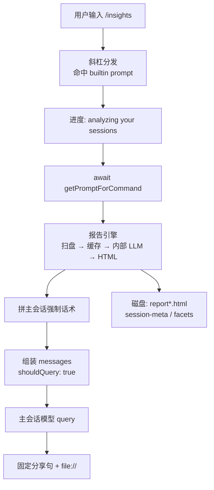
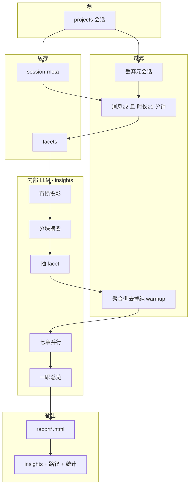

# Claude Code `/insights` 命令的端到端流程

## 一句话结论

`/insights` 是内置的 **`type: "prompt"`** 斜杠命令：先在**本机**扫历史会话、读写缓存，用多轮**内部**模型调用（`querySource: "insights"`）生成 HTML 使用报告，再让**主会话**模型按固定模板输出带 `file://` 的分享句。报告正文在 HTML；聊天窗主要递链接并可继续追问。语义分析走模型 API，不是纯离线。

提示词**原文**见 [内嵌提示词契约](../concepts/claude-code-insights-prompts.md)。本页讲链路；minify 符号集中在文末附录，正文优先用中文职责名。

**证据**：`artifacts/2.1.209/.../@cometix/claude-code/cli.js`（`VERSION: "2.1.209"`）。**未做**：执行 `/insights`、打线上 API、读本机隐私报告。

---

## 输入

| 输入 | 说明 |
|---|---|
| 用户 | 交互会话中输入 `/insights` |
| 命令约束（包装层） | 需要工作区；禁止 Skill 工具代调（`disableModelInvocation: true`） |
| 本地数据 | `projects/` 历史会话；可选已有 `usage-data/` 缓存 |
| 模型 | ① 内部分析（insights 来源）；② 主会话再答分享句 |
| 证据包 | 上列 `cli.js` |

---

## 过程

### 总览



```text
用户感知

  /insights → 卡住（扫盘 + 可能多次内部模型 + 写 HTML）
       → 聊天两行英文 + file://
       → 浏览器打开 HTML
       → （可选）同会话追问某一节
```

**调用嵌套**（L1–L3 不是三段平铺）：

```text
斜杠命中命令
  → 分发层 await getPromptForCommand        ← L3
        → await 报告引擎（generateUsageReport） ← L4 几乎全部耗时
        → 拼强制话术字符串（buildInsightsResponsePrompt）
  → 把话术放进 isMeta 消息
  → shouldQuery: true → 主会话再 query        ← L2 外壳
```

下文 **L0 → L6**；设计取舍只写源码能支撑的推断。核对 minify 名见 [附录 A](#附录-a--符号地图核对-cli-js-用)。

---

### L0 · 斜杠识别

输入以 `/` 开头进入斜杠处理，按 **name** 在命令表中查找；`insights` 为 **`source: "builtin"`**。

**入**：原始输入。  
**出**：命令对象（`type`、`getPromptForCommand`、`progressMessage` 等）。

---

### L1 · 命令对象：实现体 + 懒加载包装

acorn 可见两个 `name: "insights"` 字面量。用户路径读的是**包装层**。

| 字段 | 实现体 | 包装层（命令表入口） |
|---|---|---|
| `type` | `"prompt"` | `"prompt"` |
| `source` | `"builtin"` | `"builtin"` |
| `description` | Generate a report analyzing your Claude Code sessions | 同左 |
| `progressMessage` | analyzing your sessions | 同左 |
| `disableModelInvocation` | 无 | **`true`** |
| `requires` | 无 | **`{ workspace: true }`** |
| `getPromptForCommand` | 1 参，内联实现 | 2 参，动态加载后转发 |

```text
// 包装层：动态加载后转发到实现体
async getPromptForCommand(args, ctx) {
  const impl = (await dynamicImport(...)).default
  if (impl.type !== "prompt") throw Error("unreachable")
  return impl.getPromptForCommand(args, ctx)
}
```

命令对象是 CLI **内存注册表条目**，不是 API 字段，也不是 settings 总开关。

同模块还导出报告相关能力（正文后文用中文称呼，符号见附录）：

| 职责 | 导出名（源码 export） |
|---|---|
| 报告引擎入口 | generateUsageReport |
| 主会话强制话术模板 | buildInsightsResponsePrompt |
| 跨会话聚合 | aggregateData |
| 单会话工具等统计 | extractToolStats |
| 多会话时间重叠 | detectMultiClauding |
| 同 session 分支去重 | deduplicateSessionBranches |
| 命令实现对象 | default |

**设计取舍**

- **`prompt` 而非 `local`**：`local` 本机跑完通常不再问主模型；`prompt` 会组消息并 `shouldQuery: true`，形态是「报告 + 同会话可追问」。  
- **`disableModelInvocation: true`（仅包装层）**：禁止 Skill/Agent 代调，用户手敲可以；不禁止报告引擎内部调模型。

---

### L2 · prompt 分发：先跑完分析，再决定问不问主模型

主路径在 `case "prompt"` 里进入分发函数（实现 minify 见附录）。成功时 **`shouldQuery` 恒为 true**：表示「这批 messages 组好后，是否再调**主会话**模型」。  
它与报告引擎内部的 insights 请求无关——内部调用发生在 `await getPromptForCommand` **之内**。

返回后大致：

1. 取出 text 块；处理 hooks / 工具权限等  
2. 组装 `messages`：用户可见命令消息 + **`isMeta: true`（内容 = L3 返回的 text）**  
3. **`shouldQuery: true`** → 主会话 query  

对 `/insights`：第 1 步内部可能很久（整份报告引擎）；进度靠 `progressMessage`。

[**P-user-reply**](../concepts/claude-code-insights-prompts.md#p-user-reply) **挂进主会话**的位置 = 本层步骤 2–3（不在报告引擎那三次内部请求里）：

```text
L3 返回 [{ type:"text", text: 强制话术字符串 }]
    → 分发层 isMeta 消息          ★ 挂进当前会话
    → shouldQuery: true
    → 主模型读 isMeta → 输出分享句
```

主模型读到的是**已经生成好的**话术（含 insights JSON + `file://`），不是「请你去分析」。原文：[P-user-reply](../concepts/claude-code-insights-prompts.md#p-user-reply)。

---

### L3 · `getPromptForCommand` 实现体

```text
async getPromptForCommand(/* 参数未使用 */) {
  collectRemote = false   // 写死

  { insights, htmlPath, data, remoteStats }
      = await generateUsageReport({ collectRemote })   // L4

  reportUrl = "file://" + htmlPath
  // statsLine、summaryText（at_a_glance 四段 markdown）、header …

  return [{
    type: "text",
    text: buildInsightsResponsePrompt({
      insightsJson, reportUrl, htmlPath,
      facetsDir,    // usage-data/facets
      header, summaryText,
    }),
  }]
}
```

模板正文：[P-user-reply](../concepts/claude-code-insights-prompts.md#p-user-reply)。

L3 **不调**主会话、也**不**发 `querySource:"insights"`。  
- 内部分析提示词 → **L4** 各步的内部请求 `userPrompt`  
- [P-user-reply](../concepts/claude-code-insights-prompts.md#p-user-reply) → 此处**拼串**，进对话靠 **L2 isMeta + shouldQuery**

**设计取舍**

- 分析必须在 `getPromptForCommand` 内完成：主模型需要已有 `file://` 与 insights JSON。  
- `collectRemote` / `remoteStats`：调用写死 false，引擎不读该参数；`remoteStats` 恒空——不能推断有远程收集开关。

---

### L4 · 报告引擎（generateUsageReport）

#### L4.0 磁盘落点

| 含义 | 路径（相对配置根） |
|---|---|
| 配置根 | 常见 `~/.claude`（随环境变） |
| 历史会话 | `projects/` |
| 使用数据根 | `usage-data/` |
| facet 缓存 | `usage-data/facets/` |
| session-meta 缓存 | `usage-data/session-meta/` |
| 报告 | `usage-data/report-<时间戳>.html` 与 `report.html` |

```text
配置根
├── projects/…                 会话 transcript
└── usage-data/
    ├── session-meta/          可复算统计
    ├── facets/                模型语义标签
    ├── report-….html
    └── report.html
```

（路径 helpers 的 minify 名见附录 A。）

#### L4.1 数据漏斗



#### L4.2 控制流（与引擎 await 顺序一致）

引擎内大致顺序：**枚举会话 → 读/写 session-meta → 读 transcript → 抽 facets → 聚合与写章节 → 写 HTML**。

##### （1）枚举会话

遍历 `projects/`，收集 sessionId / path / mtime 等，按 mtime 新→旧排序。空目录或失败 → 空列表后续空跑。

##### （2）session-meta 缓存

确定性统计可复算，用文件 mtime 失效。

| 预算 | 含义 |
|---|---|
| 批大小 50 | 并行检查缓存 |
| 新建 cap 200 | 本轮最多新建 meta 条数 |
| 刷新 cap 200 | 本轮最多刷新过期 meta |

- 缓存命中且 transcript 未变 → 不读盘  
- 无缓存 → 新建队列（受 cap）  
- 过期 → 刷新队列（受 cap）；帽外沿用旧缓存  

**设计取舍**：meta 可复算 → 强缓存；cap 是完整性 vs 时延。

##### （3）读 transcript · 写回 meta

| 预算 | 含义 |
|---|---|
| 批大小 10 | 并行读日志 |

- 过滤 facet 自举元会话（前几条 user 含固定 JSON 指令或 `record_facets`）  
- 非法时间戳跳过  
- 抽出统计字段（session_id、时长、user 消息数、工具/token/语言等）并写回 session-meta  
- 读失败可回退旧 meta  

仅「新建/刷新」队列会读盘；纯缓存命中本轮**没有** transcript 句柄 → 后面无法新抽 facet。

##### （4）质量过滤

同时满足才继续：用户消息数 ≥ **2**，时长 ≥ **1** 分钟。

##### （5）facets（语义标签）

| 预算 | 含义 |
|---|---|
| 新抽 cap 50 | 本轮最多新抽 session 数 |
| 新抽批 50 | 并行 |
| 投影 30000 / 切片 25000 | 过长则分块摘要 |
| 输出上限 500 / 4096 | 分块摘要 / 抽 facet |

```text
有合法缓存 → 用缓存
否则若本轮仍有 transcript 且名额未满：
  有损投影 →（过长则分块摘要）→ 抽 facet → 写缓存
否则本轮无 facet
```

**提示词挂在哪（本步）** — 内部请求的 `userPrompt`，**不进聊天窗**：

| P-id | 挂载 | 何时 |
|---|---|---|
| [P-chunk-sum](../concepts/claude-code-insights-prompts.md#p-chunk-sum) | 分块函数：`userPrompt = 模板 + 投影切片`；maxTokens **500** | 投影过长需切片 |
| [P-facet](../concepts/claude-code-insights-prompts.md#p-facet) + [schema](../concepts/claude-code-insights-prompts.md#p-facet-schema) | 抽 facet：`userPrompt = 指南 + schema + 投影`；**4096** | 无缓存需新抽 |

索引：[提示词在链路中的位置](../concepts/claude-code-insights-prompts.md#p-index)。

**有损投影**（进模型的不是原始 JSONL）：

| 来源 | 规则 |
|---|---|
| 头 | session 前缀、日期、项目、时长 |
| 用户 | 每条最多约 500 字符 |
| 助手文本 | 每条最多约 300 字符 |
| 工具 | 只留工具名，不含参数/结果 |

校验 facet：goal / outcome / brief_summary 为 string；三类 counts 为非 null object。

**设计取舍**：facet 贵且不稳，与 meta 分目录；单次新抽 cap 50。

##### （6）聚合 · 报告七章 · 一眼总览

- **warmup**：目标类别仅有 `warmup_minimal` 的会话不进**聚合数字**；写章节时用的 facet 表仍是**完整表**（采样列表仍可能见到 warmup，受下面条数帽约束）。  
- **聚合**：跨会话工具、语言、token、git、满意度/摩擦等；并检测约 **30 分钟**窗口多会话时间重叠。  
- **写章节前采样**（不是全量 facet 原文）：

  | 采样 | 上限 |
  |---|---|
  | 会话摘要 | 50 |
  | 摩擦细节 | 20 |
  | 用户给 Claude 的指示 | 15 |

- **并行七章**（各 maxTokens 8192），再合成 [P-at-a-glance](../concepts/claude-code-insights-prompts.md#p-at-a-glance)。

**提示词挂在哪（本步）** — 仍是内部 `userPrompt`（与上步合共 **3** 处 `querySource:"insights"`）：

```text
userPrompt = 章节模板 + "\n\nDATA:\n" + 数据串
// 七章与 glance 共用同一请求拼装函数；glance 时数据串常为空
```

| P-id | 说明 |
|---|---|
| [P-section-*](../concepts/claude-code-insights-prompts.md#p-section) | 七章并行；[请求拼装](../concepts/claude-code-insights-prompts.md#p-request-assembly) |
| [P-at-a-glance](../concepts/claude-code-insights-prompts.md#p-at-a-glance) | 七章之后再调一次 |

```text
transcript → 投影 →（按需）分块摘要 → 抽 facet
  → 聚合 → 采样 → 七章 → 一眼总览 → 渲染 HTML
```

##### （7）写 HTML · 返回

写入带时间戳的报告与 `report.html`（权限字面量 384 = Unix 0600 意图）。返回 insights、html 路径、聚合统计等；远程统计槽位恒空。

#### L4.3 内部模型公共选项

三处 insights 调用共性：`isNonInteractiveSession: true`、空 system、无 MCP 工具列表、模型走默认 Opus 路由辅助。输出上限：分块 500、facet 4096、章节/总览 8192。

[P-user-reply](../concepts/claude-code-insights-prompts.md#p-user-reply) **不在**这三处 → 见 L2 / L3 / L5。

**L4 设计取舍**：双缓存（可复算 vs 贵）；漏斗多层压缩；批与 cap 限制单次成本；`querySource` 与普通对话分离。

---

### L5 · 主会话强制话术（[P-user-reply](../concepts/claude-code-insights-prompts.md#p-user-reply)）

`buildInsightsResponsePrompt` 是**纯字符串模板**（无 IO、无内部模型）。填入 insights JSON、`file://`、facets 目录、标题与摘要后，要求主模型**只能**输出 `<message>…</message>` 内固定分享句。

**挂进上下文**：L3 拼串 → [L2](#l2) isMeta → `shouldQuery` 主会话。原文：[P-user-reply](../concepts/claude-code-insights-prompts.md#p-user-reply)。

**设计取舍**：重内容在 HTML；聊天窗避免刷屏。是否 100% 原样输出属运行时。

---

### L6 · 用户可见结果

1. 主会话按 isMeta 中的 [P-user-reply](../concepts/claude-code-insights-prompts.md#p-user-reply) 输出分享句。  
2. 浏览器打开 HTML 报告。  
3. 同会话上下文中仍有 insights JSON，可追问（取决于上下文是否还在）。

```text
可见     分享句 + file:// ；HTML 正文
默认不展示 isMeta 中的 insights 全文
磁盘     session-meta / facets
后端     投影与内部 insights 请求
```

---

## 输出

| 通道 | 内容 |
|---|---|
| 磁盘 | `report-*.html`、`report.html`；更新后的缓存目录 |
| 聊天 | 固定分享句 + `file://` |
| 主会话上下文 | insights JSON + 摘要（供追问） |
| 内部模型 | 分块 / facet / 七章与总览 |

---

## 已知边界

| 边界 | 说明 |
|---|---|
| 版本 | 锚定 2.1.209；minify 名与批大小会变 |
| 数据 | HTML/缓存本机；语义文本经模型 API |
| 远程收集 | 写死关闭；无可用开关 |
| `file://` | 路径直接拼接；Windows 可点开性未实测 |
| 文件权限字面量 | Unix 0600 意图；Windows 落实不同 |
| 覆盖 | meta/facet 有 cap；章节采样有上限——预算样本 |
| 失败 | 单次 facet/章节失败多跳过 |
| 提示词正本 | 仅 [契约页](../concepts/claude-code-insights-prompts.md) |

---

## 证据与复核方式

| 项 | 内容 |
|---|---|
| 文件 | `artifacts/2.1.209/global-prefix/node_modules/@cometix/claude-code/cli.js` |
| 包 | `@cometix/claude-code` **2.1.209** |
| SHA-256 | `724361250D92E0EBF10FEE99387CCD25FA29E0D463600FE06DFA02F570CC4A89` |
| 来源 | [Cometix 恢复流水线](../PriorKnowledge/cometix-claude-code-restore.md) |
| 方法 | acorn 定位 + 关键函数体/字面量锚点；不以临时截取脚本长度为证据 |
| 禁止 | 为复核执行 `/insights` 或打 API |
| 检索串 | `name:"insights"` · `generateUsageReport:` · `querySource:"insights"` · `The user just ran /insights` · `mode:384` · `warmup_minimal` · `1800000` |

---

## 相关页面

- [Claude Code /insights 内嵌提示词契约](../concepts/claude-code-insights-prompts.md)  
- [CometixSpace-claude-code 恢复流水线](../PriorKnowledge/cometix-claude-code-restore.md)  
- [acorn 与 JS AST 解析工具](../PriorKnowledge/acorn-and-js-ast-parsers.md)  

---

## 附录 A · 符号地图（核对 cli.js 用）

正文尽量不堆 minify。需要在 bundle 里搜索时对照本表。

| 正文怎么说 | 导出名 / 含义 | 2.1.209 实现名 |
|---|---|---|
| 报告引擎 | generateUsageReport | `Osp` |
| 强制话术模板 | buildInsightsResponsePrompt | `Nsp` |
| 跨会话聚合 | aggregateData | `Msp` |
| 单会话工具统计 | extractToolStats | `Dsp` |
| 多会话时间重叠 | detectMultiClauding | `Lsp` |
| 会话分支去重 | deduplicateSessionBranches | `Vm_` |
| 有损投影 | （会话文本进模型前） | `Gm_` |
| 枚举会话 | | `ch_` |
| session-meta 读 / 写 | | `Jm_` / `Qm_` |
| 读 transcript | | `nIo` |
| facets 读 / 写 / 抽 | | `Ym_` / `Xm_` / `Zm_` |
| 长文分块 | 投影后过长 | `Km_` + `zm_` |
| 章节编排 / 单次章节请求 | | `th_` / `Isp` |
| HTML 渲染 | | `ah_` |
| facet 校验 | | `$sp` |
| 配置根 / projects / usage-data / facets / session-meta | 路径 helpers | `pn` / `xz` / `znn` / `rIo` / `P8s` |
| prompt 分发主路径 | | `Zxs`（`cxy` 为旁路薄封装） |
| 默认 Opus 路由辅助 | | `sS` ← `Rsp` / `Om_` |
| 命令实现 / 懒加载模块 | | `ph_` / `Fsp` |

---

## 附录 B · 单次运行预算

| 限制什么 | 约值 | 用在哪 |
|---|---|---|
| meta 检查并行批 | 50 | 缓存检查 |
| 新建 / 刷新 meta | 各 200 | 单次量帽 |
| 读 transcript 批 | 10 | 磁盘 |
| 新 facet 上限 / 批 | 50 / 50 | 模型费用 |
| 投影过长阈值 / 切片 | 30000 / 25000 字符 | 分块前 |
| 用户 / 助手投影截断 | 500 / 300 字符 | 投影 |
| 分块 / facet / 章节输出 | 500 / 4096 / 8192 token | 内部调用 |
| 章节上下文采样 | 50 / 20 / 15 | 摘要 / 摩擦 / 指示 |
| 多会话重叠窗口 | 30 分钟 | 重叠检测 |
| HTML 权限字面量 | 384（Unix 0600 意图） | writeFile |
| 最短可分析会话 | ≥2 条用户消息，≥1 分钟 | 质量过滤 |
