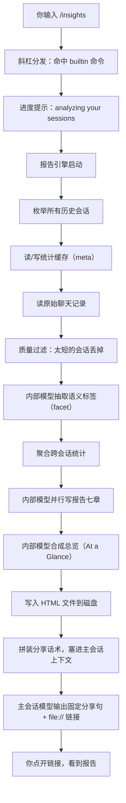

# Claude Code `/insights` 命令：从敲下回车到看见报告，全程发生了什么

你输入 `/insights`，回车。屏幕卡住了。几十秒，可能是几分钟。然后聊天窗弹出两行英文加一个 `file://` 链接。点开链接，浏览器里是一份漂亮的 HTML 报告——告诉你这个月用 Claude 做了什么、哪里顺畅哪里卡壳、甚至还有几条"要不要试试这个功能"的建议。

**这篇文章要回答的就是：在那段等待的时间里，到底发生了什么。**

往下读之前只需要先搞懂一件事：整个过程里有两个不同的模型角色。**内部分析请求**负责分析你的历史会话、写 HTML 报告；**主会话模型**就是聊天窗里跟你对话的那位，它只负责把报告链接递到你手上。两者不一定代表不同的模型家族，关键区别在于请求发生的位置和承担的职责：内部分析你看不到，主会话输出你一直看得到。分清这两个角色，后面就一路畅通。

---

## 俯瞰：一张图讲完全程



整个链路分两层：**上面那条（E1 到 E9）** 是报告引擎的工作区，里面既有本地读盘和统计，也有内部模型请求，占用了绝大多数时间；**下面那条（F 到 G）** 才是主会话模型的事。你在聊天窗感受到的长等待，主要发生在报告引擎返回之前。

---

## 分步详解

### 第 1 步：斜杠识别

Claude Code 的斜杠命令系统是这样工作的：你输入的内容如果以 `/` 开头，就进入命令表查找。`/insights` 是内置命令（`source: "builtin"`），类型为 `"prompt"`。`"prompt"` 类型意味着：命令处理完后，还要再调一次主会话模型来输出结果。与之对应的是 `"local"` 类型（本机跑完直接出结果，不再问模型）。`/insights` 选择 `prompt` 后，实际得到的效果正是"报告已经生成，同时当前会话还能承接追问"；源码没有另外留下文字说明，告诉我们这是否是唯一设计理由。

### 第 2 步：命令对象的包装层

实际上 `insights` 这个命令在源码中有两层定义。用户调用走的是**包装层**——一个带约束条件的入口：

- `requires: { workspace: true }` —— 必须在一个项目目录里跑
- `disableModelInvocation: true` —— 禁止 Skill 或子代理代调这个命令
- `progressMessage: "analyzing your sessions"` —— 就是你在屏幕上看到的那行进度文字

包装层做的事很薄：动态加载真正的实现体，然后把参数转发过去。真正的逻辑在实现体的 `getPromptForCommand` 函数里。

**一个容易误解的点**：`disableModelInvocation: true` 的意思是"不要让别的 AI 工具代替用户来调用 `/insights`"，**不是**"禁止内部调模型"。报告引擎里的内部模型调用不受这个标志影响。

### 第 3 步：进入 getPromptForCommand —— 报告引擎的入口

这是一个 async 函数，它的核心只有一件事：

```
{ insights, htmlPath, data }
    = await generateUsageReport()   // 承担几乎全部重活

return buildInsightsResponsePrompt({
    insightsJson, reportUrl, htmlPath, facetsDir, header, summaryText
})  // 纯字符串拼接
```

`generateUsageReport` 就是报告引擎。这一步承担了整条链路几乎全部重活——我们下一节专门展开它。

`buildInsightsResponsePrompt` 是一个纯字符串模板函数——把引擎产出的 JSON、HTML 路径、摘要等信息填进一个固定模板，生成一段"强制话术"。这段话术之后会告诉主会话模型：你只能说 `<message>` 标签里的那两句话，别自己发挥。它的产品意图是让每次 `/insights` 的可见输出保持一致，最终是否逐字遵从仍取决于模型运行时。

### 第 4 步：报告引擎 —— 全篇最重的一步

这是你等待的时间里真正在发生的事情。引擎的逻辑可以概括为八个字：**扫盘 → 缓存 → 分析 → 写报告**。

#### 4.1 数据放在哪里

引擎读写的本地文件都在你的 Claude Code 配置目录下（通常是 `~/.claude`）：

```
配置根目录
├── projects/                     ← 历史会话的原始消息日志（JSONL）
└── usage-data/
    ├── session-meta/             ← meta 缓存：从聊天记录算出来的统计数字
    ├── facets/                   ← facet 缓存：内部模型给每个会话打的语义标签
    ├── report-<时间戳>.html      ← 带时间戳的报告副本
    └── report.html               ← 最新报告（每次覆盖）
```

`projects/` 里存的是你每一次跟 Claude 对话的完整记录——每一条你发的消息、Claude 的回复、工具调用、文件修改，全在 JSONL 文件里。报告引擎把这些原始数据一层层压缩、分析，最终变成 HTML 报告。

#### 4.2 同样重要的：两类缓存

`/insights` 每次运行都要面对你所有的历史聊天记录。但聊天记录可能很多——几百个会话、几十万条消息。每次都从头读一遍太慢了。所以引擎在 `usage-data/` 下维护了两类缓存：

**meta（统计缓存）**——存的是"算得出来"的东西。比如这个会话聊了多久、用了多少次工具、涉及哪些编程语言、消耗了多少 token。在同一版本的提取逻辑下，这些数字由聊天记录文件确定；只要文件没变（通过最后修改时间判断），已有 meta 就可以复用。引擎单次运行最多新建 200 条、刷新 200 条 meta。

**facet（语义标签缓存）**——存的是"模型才能判断"的东西。比如这个会话的核心目标是什么、用户满意度怎样、遇到了什么类型的摩擦。这些判断依赖模型推理，不是纯计算能得出的。模型请求会消耗 token 和调用资源，每次结果也可能略有不同，输出格式还可能校验失败——所以 facet 的缓存策略比 meta 保守得多：单次运行最多新抽 50 个会话的 facet。

**为什么分成两类？** 因为成本和确定性截然不同。meta 纯计算 → 不需要模型请求 → 可以积极复用。facet 靠模型 → 每次都要消耗 token 和调用资源 → 保守缓存，按需新抽。分开存放意味着 meta 缓存更新不会误伤 facet 缓存，反过来也一样。

#### 4.3 引擎内部的控制流

下面是引擎每一步的具体动作。

**第一步：枚举会话。** 遍历 `projects/` 目录，收集所有 session ID、文件路径、最后修改时间，按时间从新到旧排序。如果目录为空（比如你从来没聊过天），就空跑退出。

**第二步：读/写 meta 缓存。** 引擎以 50 个一批并行检查每个会话的 meta 缓存是否仍然有效：如果聊天记录文件自上次缓存之后修改时间未变，就直接复用旧缓存；如果变了或从来没缓存过，就标记为"需要重新计算"。

**第三步：读原始聊天记录，写回 meta。** 对每个需要重新计算的会话，以 10 个一批并行读取原始 JSONL 日志。读的过程中同时做几件事：

- 丢弃"元会话"——这不是你跟 Claude 的正常对话，而是 `/insights` 内部用来做 facet 自举的特殊会话（消息内容包含固定的 JSON 指令或 `record_facets` 关键字）
- 跳过时间戳非法的记录
- 从消息日志中提取统计字段：会话时长、你发了几条消息、Claude 用了多少次工具、涉及哪些编程语言、token 消耗量等
- 把提取结果写回 `session-meta/` 目录

**关键细节：只有"需要重新计算"的会话才会在这一步被读盘。** 如果某个会话的 meta 缓存命中（聊天记录没变），这一步就不会为它打开文件。这也意味着缓存命中的会话在这一轮**没有机会**新抽 facet——因为后面抽 facet 需要的是从聊天记录投影出来的文本，而投影的前提是读了盘。

**第四步：质量过滤。** 不是所有会话都值得分析。同时满足以下两个条件的会话才会进入后续流程：

- 你发的消息数 ≥ 2 条
- 对话时长 ≥ 1 分钟

只发了一条消息就关掉的窗口、或者开了几十秒就退出的对话，不会进入 facet 抽取和报告生成。太短的会话没有足够的信息量，分析出来也不会有什么价值。

**第五步：抽取 facet（语义标签）。** 这是内部模型进入单会话语义分析的核心环节。facet 是引擎对每个会话的"结构化理解"——用 JSON 描述这个会话的根本目标是什么、用户是否满意、有没有遇到摩擦、属于哪种会话类型。如果会话投影过长，内部模型会在正式抽 facet 之前先出场做分块摘要。

实现没有把聊天记录的原始 JSONL 直接交给内部模型。原始日志可能很大，也包含许多当前分析不需要的内容（完整的工具调用参数、文件 diff、系统消息……）。所以引擎先做一次**有损投影**，把冗长的原始记录压成模型更容易消费的简明文本：

| 信息来源 | 投影规则 |
|---|---|
| 会话头 | 保留 session ID 前缀、日期、项目名、总时长 |
| 你的消息 | 每条最多保留约 500 个字符 |
| 助手的文本回复 | 每条最多保留约 300 个字符 |
| 工具调用 | 只保留工具名称，丢弃参数和返回值 |

投影后如果文本还是太长（超过 30000 字符），就把投影切成每片约 25000 字符的块，先对每块调内部模型做摘要（输出上限 500 token），再把所有摘要拼接起来。这样即使原始会话很大，进入 facet 抽取阶段的输入也会比原始日志更受控。

facet 抽取本身：把投影（或分块摘要的拼接）作为 `userPrompt`，附上详细的指令和 JSON Schema，让内部模型输出结构化的 JSON。单次运行最多新抽 50 个会话的 facet，以 50 个一批并行。

**第六步：聚合与并行写七章。** 有了所有会话的 meta 和 facet 之后，引擎做两件事：

1. **跨会话聚合**：统计你用了多少次各种工具、涉猎了哪些语言、各目标类别的分布、满意度/摩擦的整体面貌、是否在多个会话间同时工作（30 分钟窗口内的会话时间重叠检测）。其中，被 facet 标记为"纯热身"（`warmup_minimal`）的会话会从聚合数字中剔除，确保数据不被无实质内容的会话拉偏——但这不妨碍它们出现在报告章节的采样列表中。

2. **并行生成七章报告**：把聚合统计打包成一份公共数据串，同时对七个章节各调一次内部模型。每章有独立的提示词模板，但共享同一份数据。每章的输出上限均为 8192 token。七章**全部并行**发出——不是一章一章排队等。

| 章节 | 内容 |
|---|---|
| 工作领域 | 你在哪些项目/方向上使用 Claude Code |
| 交互风格 | 你是怎么跟 Claude 交流的——快节奏迭代还是提前写好详细指令 |
| 做得好的地方 | 你的工作流中哪些模式效果显著 |
| 摩擦分析 | 哪些地方经常出问题——是 Claude 理解错了，还是环境配置的锅 |
| 改进建议 | 基于你的使用模式，推荐哪些 Claude Code 功能（含具体命令和配置） |
| 前瞻机会 | 模型能力提升后，你可以尝试的大胆工作流 |
| 结尾彩蛋 | 从采样后的会话材料中找一个有趣或意外的瞬间 |

**第七步：合成总览（At a Glance）。** 七章全部返回后，引擎把各章结果作为上下文，再调一次内部模型，生成一个四段式的总览：

1. **What's working** —— 你的独特交互方式和亮点
2. **What's hindering you** —— 阻碍你效率的因素（分清是 Claude 理解错了，还是你侧有可改进的习惯）
3. **Quick wins to try** —— 现在就可以试的具体建议
4. **Ambitious workflows** —— 面向更强模型的前瞻规划

总览使用教练式的语气，不堆数字，定性而非定量。数字留给 HTML 里的图表；总览负责给你方向感。

**第八步：写 HTML，返回结果。** 把七章 JSON、总览 JSON、聚合统计一起喂给 HTML 渲染函数，写出两个文件：`report-<时间戳>.html` 和 `report.html`。文件权限设置为 Unix 0600（只有你能读，Windows 上的落实方式可能不同）。引擎返回结构化的 insights JSON、HTML 文件路径、facets 目录路径等，供上层使用。

#### 4.4 内部模型调用的共同特征

源码中有三处 `querySource: "insights"` 的内部模型**调用点**：分块摘要、facet 抽取，以及七章/总览共用的章节请求函数。这里的"三处"不是"一次运行只请求三次"——实际请求次数由数据决定：一个超长会话可能产生多个分块摘要请求，多个待分析会话会各自产生 facet 请求，而最后一处调用点会先并行写七章，再额外写一次总览。

这三处调用点共享一些默认选项：

- 均为 `isNonInteractiveSession: true` —— 这不是交互式对话
- system prompt 均为空数组 —— 所有指令都在 user prompt 里
- 不使用 MCP 工具
- 模型路由走默认的 Opus 辅助逻辑

也就是说，内部模型每次拿到的东西就是"一段指令 + 一段数据"，不需要额外的系统角色约束，也不需要外部工具能力。

### 第 5 步：拼装主会话话术

报告引擎返回后，`getPromptForCommand` 把返回的 insights JSON、`file://` 路径、facets 目录、总览摘要等信息填入 `buildInsightsResponsePrompt`。这个函数生成一段长字符串，核心结构是：

```
用户刚跑了 /insights，以下是完整 insights 数据：[JSON 数据...]

报告 URL：[file://...]
HTML 文件：[本地路径]
Facets 目录：[本地路径]

总览摘要（仅供你参考，用户还没看到任何输出）：[At a Glance markdown]

将 <message> 标签之间的文本原样作为你的完整回复输出。不要省略任何一行：

<message>
Your shareable insights report is ready: [file:// 链接]
Want to dig into any section or try one of the suggestions?
</message>
```

这段话里包含了完整的 insights JSON——不是给用户看的，是给主会话模型的**上下文养料**。这样你在看到报告链接后，如果马上追问"摩擦分析那章再详细说说"，主会话模型通常可以直接从仍在当前上下文里的 JSON 数据回答，而不需要重新跑一遍 `/insights`。如果后续对话很长、上下文被压缩或淘汰，这份数据不保证永久可用。

### 第 6 步：主会话输出

`getPromptForCommand` 返回后，斜杠分发层把这段文本以 `isMeta: true` 的方式挂进当前会话的上下文。`isMeta` 的意思是：这段内容是给模型看的上下文，默认不在聊天窗展示为一条长消息。然后分发层设置 `shouldQuery: true`，让主会话模型再做一次 query。

主会话模型读到 `isMeta` 里的强制话术（特别是 `<message>` 标签），被要求**原样**输出那两行英文：一个 `file://` 链接加一句"想深入了解某一节或试试建议吗？"。这是模板规定的目标输出，不是程序绕过模型后直接打印的硬编码结果。

### 第 7 步：你最终看到的结果

| 通道 | 内容 |
|---|---|
| 聊天窗 | 两行英文分享句 + `file://` 链接 |
| 浏览器（点开链接后） | 完整 HTML 报告：图表、七章分析、总览、建议 |
| 磁盘 | `report-*.html`、`report.html`、更新后的 `session-meta/` 和 `facets/` 缓存 |
| 主会话上下文 | 完整的 insights JSON（供你追问某一节时使用） |

---

## 设计上为什么这么做

下面先以源码中能验证的结构为基础，再讨论它可能带来的工程收益。凡是涉及"为什么这样设计"，都应当读作基于实现的合理推断，而不是源码作者留下的官方设计说明。

**为什么把内部分析和主会话输出拆成两个角色？** 源码能确认的是：批量分析在 `getPromptForCommand` 返回前完成，主会话只在报告已经生成后再 query 一次。这样拆分的直接效果，是把"扫历史、抽标签、写章节"和"在当前聊天里递链接、承接追问"隔离开。由此可以合理推测，设计者希望报告生成不依赖主会话临场组织整篇内容，同时又保留同一会话继续追问的体验。

**为什么 meta 和 facet 分开缓存？** 因为成本和确定性不同。meta 在同一版本逻辑下可由 transcript 重算，缓存有效性还能直接绑定文件修改时间；facet 则依赖模型语义分析，会消耗调用资源，也可能出现结果波动或格式校验失败。分开存放让两类数据可以采用不同的失效与数量策略，更新 meta 时也不必连带重做 facet。

**为什么单次运行有各种数量上限？** `/insights` 的报告引擎位于你输入命令后的等待路径上。没有上限时，历史会话越多，本轮工作量就可能越不可控。源码没有写下设计说明，但这些 cap 的实际效果很清楚：它们用覆盖率换取单次运行的成本和等待时间。缓存会跨运行保留，因此本轮没有进入新建或新抽名额的会话，后续运行仍有机会被处理；这不等于每一份报告都会覆盖全部历史。

**为什么报告正文在 HTML 而不是聊天窗？** 因为聊天窗不适合展示复杂排版——图表、分栏、色彩编码的摩擦分类，这些在 HTML 里很容易，在纯文本里很痛苦。把重内容放在 HTML、聊天窗只放链接，是务实的工程选择。

**为什么强制主会话模型只说两句话？** 如果没有强制话术，主会话模型可能会热情地把整个报告总结一遍，刷满你的屏幕——这会让你困惑（"到底看聊天窗还是看 HTML？"），也可能让模型的解读和 HTML 里的呈现产生不一致。固定话术的效果是尽量收紧可见输出，把真正的信息量留给 HTML；它提高了一致性，但不是脱离模型遵从度的硬保证。

---

## 对你而言意味着什么

**数据边界方面**：这条路径不会把原始 JSONL 原封不动地交给内部模型，而是先做有损投影：截断用户和助手文本，只保留工具名称，必要时再分块摘要。但投影后的内容仍会发送给你当前配置所使用的模型后端；它仍然可能包含文件名、错误信息、业务语义或其他敏感片段。报告 HTML 和缓存写在本地，不代表整个分析过程是纯离线的。

**性能方面**：在缓存为空且历史会话较多时，第一次运行通常最慢，因为它需要新建 meta，并可能给最多 50 个会话新抽 facet。之后的运行可以复用缓存，往往更快；但如果最近新增或修改了很多会话，仍可能触发一批新的读盘、统计和 facet 请求。

**数据持久性方面**：`session-meta/` 和 `facets/` 是增量缓存，源码没有展示一套随 transcript 删除而同步清理孤立文件的流程。如果你删了 `projects/` 下的聊天记录，对应缓存文件可能仍留在磁盘上；由于本轮会话清单从 `projects/` 重新枚举，这类孤立缓存通常不会继续进入当前报告，但也不能指望 mtime 检查替你删除它。mtime 失效判断只适用于源 transcript 仍然存在、可以比较修改时间的会话。

---

## 已知的局限

| 局限 | 说明 |
|---|---|
| 版本锁定 | 以上分析基于 `@cometix/claude-code` 2.1.209 版本。minify 后的函数名、批大小、cap 值等细节会随版本变化 |
| 远程收集 | 源码中将远程数据收集标志写死为 `false`，`remoteStats` 恒为空——但这不代表未来版本不会改变 |
| `file://` 链接 | Windows 上点击 `file://` 链接能否直接在浏览器中打开 HTML，取决于系统配置和浏览器安全策略，未实测 |
| 报告权限 | HTML 文件的权限字面量为 Unix 0600 意图。Windows 对此的落实方式不同，不应假设 Windows 下该文件也严格仅限当前用户可读 |
| 采样有上限 | 七章所用的会话摘要采样上限为 50 条、摩擦详情 20 条、用户指示 15 条。如果你有大量会话，报告可能不覆盖全部 |
| 单点失败 | 单个 facet 抽取失败或单个章节生成失败，引擎通常静默跳过而非崩溃——报告可能缺失个别内容 |

---

## 提示词去哪儿看

引擎内部使用的每一段提示词（分块摘要、facet 抽取、七章、总览、主会话强制话术），其英文原文和中文对照在配套页面：[Claude Code /insights 内嵌提示词全文](../concepts/claude-code-insights-prompts.md)。

---

## 附录 A：源码符号速查

正文中使用了中文职责名来称呼各函数（如"报告引擎"、"有损投影"）。以下对照表用于在 cli.js 源码中定位对应的 minify 实现。**不需要核对源码的读者可以完全跳过本附录。**

| 正文称呼 | 源码导出名 | 2.1.209 minify 名 |
|---|---|---|
| 报告引擎 | `generateUsageReport` | `Osp` |
| 强制话术模板 | `buildInsightsResponsePrompt` | `Nsp` |
| 跨会话聚合 | `aggregateData` | `Msp` |
| 单会话工具统计 | `extractToolStats` | `Dsp` |
| 多会话时间重叠检测 | `detectMultiClauding` | `Lsp` |
| 会话分支去重 | `deduplicateSessionBranches` | `Vm_` |
| 有损投影 | 非导出，会话文本进模型前的截断/转换 | `Gm_` |
| 枚举会话 | 非导出 | `ch_` |
| meta 读 / 写 | 非导出 | `Jm_` / `Qm_` |
| 读聊天记录 | 非导出 | `nIo` |
| facet 读 / 写 / 抽取 | 非导出 | `Ym_` / `Xm_` / `Zm_` |
| 长文分块摘要 | 非导出 | `Km_` + `zm_` |
| 章节编排 / 单次章节请求 | 非导出 | `th_` / `Isp` |
| HTML 渲染 | 非导出 | `ah_` |
| facet 校验 | 非导出 | `$sp` |
| 配置根 / projects / usage-data / facets / session-meta 路径 | 路径辅助函数 | `pn` / `xz` / `znn` / `rIo` / `P8s` |
| 斜杠分发主路径 | 非导出 | `Zxs` |
| 默认 Opus 路由辅助 | 非导出 | `sS` ← `Rsp` / `Om_` |
| 命令实现体 / 懒加载模块 | 非导出 | `ph_` / `Fsp` |

### 在源码中检索

建议用以下字符串在 cli.js 中定位关键位置：

- `name:"insights"` → 命令对象字面量
- `generateUsageReport:` → 报告引擎导出
- `querySource:"insights"` → 内部模型调用的三处标记
- `The user just ran /insights` → 主会话强制话术模板
- `mode:384` → HTML 文件写盘权限
- `warmup_minimal` → 热身会话过滤关键字
- `1800000` → 多会话重叠检测窗口（30 分钟的毫秒数）

---

## 附录 B：单次运行预算总览

| 限制项 | 约值 | 作用域 |
|---|---|---|
| meta 检查并行批 | 50 | 缓存有效性检查 |
| meta 新建上限 | 200 | 单次运行 |
| meta 刷新上限 | 200 | 单次运行 |
| 读聊天记录批大小 | 10 | 并行读盘 |
| facet 新抽上限 | 50 | 单次运行 |
| facet 新抽批大小 | 50 | 并行请求 |
| 投影长度阈值 | 30000 字符 | 超过则触发分块摘要 |
| 摘要切片大小 | 25000 字符 | 每片 |
| 用户消息投影截断 | 500 字符 | 每条 |
| 助手文本投影截断 | 300 字符 | 每条 |
| 分块摘要输出 | 500 token | 每片 |
| facet 输出 | 4096 token | 每个会话 |
| 章节/总览输出 | 8192 token | 每章 |
| 会话摘要采样 | 50 条 | 七章输入 |
| 摩擦详情采样 | 20 条 | 七章输入 |
| 用户指示采样 | 15 条 | 七章输入 |
| 多会话重叠窗口 | 30 分钟 | 重叠检测 |
| HTML 权限字面量 | 384（Unix 0600 意图） | 写盘 |
| 最短可分析会话 | ≥2 条用户消息 且 ≥1 分钟 | 质量过滤 |

---

## 证据来源

| 项 | 内容 |
|---|---|
| 分析文件 | `artifacts/2.1.209/global-prefix/node_modules/@cometix/claude-code/cli.js` |
| 包版本 | `@cometix/claude-code` 2.1.209 |
| SHA-256 | `724361250D92E0EBF10FEE99387CCD25FA29E0D463600FE06DFA02F570CC4A89` |
| 来源 | Cometix 恢复流水线 |
| 方法 | acorn 8.17.0 AST 解析；template literal 括号平衡扫描；关键函数体和字面量锚点交叉验证 |
| 未做 | 未实际执行 `/insights`、未对 API 发起请求、未读取本机隐私报告 |

---

## 交互演示

- [demos/insights-pipeline](../../demos/insights-pipeline/) — `/insights` 报告引擎流水线逐步演示（脚手架，实现待补）
